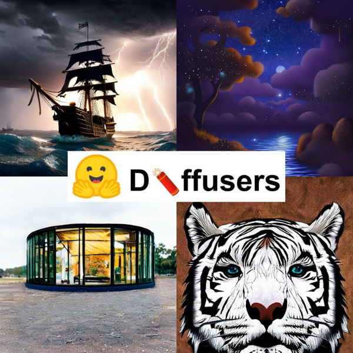

# Introduction to Hugging Face Diffusers

This folder contains the notebook and images for [Introduction to Hugging Face Diffusers](https://learnopencv.com/hugging-face-diffusers/) article.

## AI Courses by OpenCV

Want to become an expert in AI? [AI Courses by OpenCV](https://opencv.org/courses/) is a great place to start.

