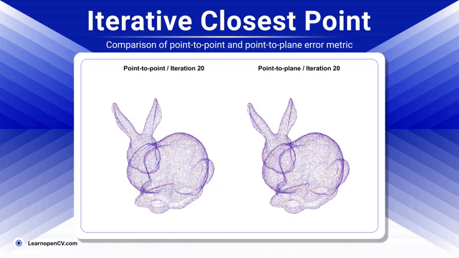

# Understanding Iterative Closest Point (ICP) Algorithm 

**This repository contains inference code for [ Iterative Closest Point (ICP) Algorithm](https://learnopencv.com/iterative-closest-point-icp-explained/) blogpost** 

---

#### Simple Python Implementation

To run,

`python test.py`

#### Using Open3D

1. [ Open3D ICP Registration](https://github.com/isl-org/Open3D/blob/4356c172767a65209d2fe6dd76ff571f10293249/docs/jupyter/pipelines/icp_registration.ipynb#L4)
2. [Introduction to Point Cloud Registration using Open3D](https://medium.com/@amnahhmohammed/gentle-introduction-to-point-cloud-registration-using-open3d-c8503527f421)

---

## AI Courses by OpenCV

Want to become an expert in AI? [AI Courses by OpenCV](https://opencv.org/courses/) is a great place to start.

