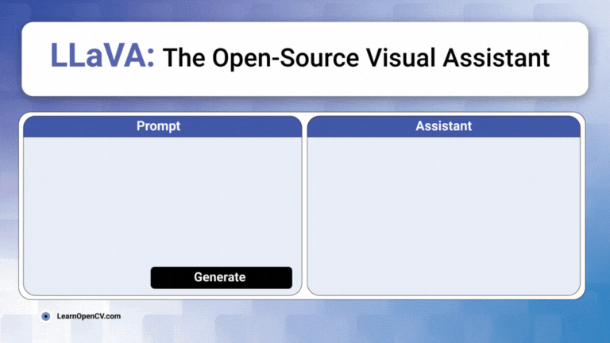

# The Definitive Guide to LLaVA: Inferencing a Powerful Visual Assistant

This repository contains the script to perform inferencing with LLaVA-1.5-7B model. This is a part of the LearnOpenCV blog post - [The Definitive Guide to LLaVA: Inferencing a Powerful Visual Assistant](https://learnopencv.com/llava-training-a-visual-assistant/).

## AI Courses by OpenCV

Want to become an expert in AI? [AI Courses by OpenCV](https://opencv.org/courses/) is a great place to start.

