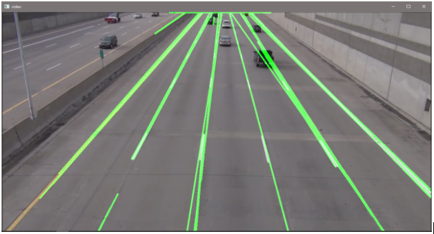
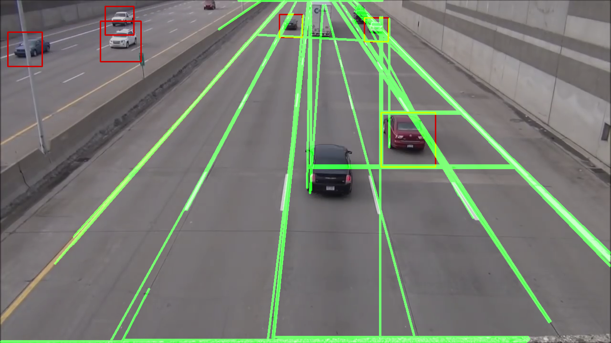

# Lane Change Detection Using OpenCV & Image Processing

## Run Code -
* python lanes.py
* python detect.py
* python final.py

**Python version 3.5 is used.**
**OpenCV version 4.4 is used.**

## Sample Result -

### Lane detection with canny edge detector:

### Car Detection with Haar Cascade

### Combined Output:

### Lane Change alert:

# AI Courses by OpenCV
Want to become an expert in AI? [AI Courses by OpenCV](https://opencv.org/courses/) is a great place to start.
