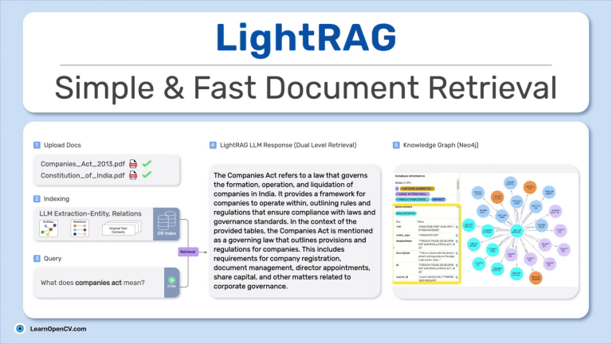

# LightRAG For Legal Document Analysis

This folder contains the Scripts and Index files for the LearnOpenCV article  - **[LightRAG: Simple and Fast Retrieval-Augmented Generation for Legal Doc Analysis](https://learnopencv.com/lightrag/)**.

### PDF Samples Used:
* [Companies Act 2013](https://www.mca.gov.in/Ministry/pdf/CompaniesAct2013.pdf)
* [Constitution of India](https://legislative.gov.in/constitution-of-india/)

### Indexed Json Storage File for Above Docs Download:
- We are providing indexed files of the vector database and JSON key-value storage for the PDF samples, processed with a chunk size of 1,200 tokens and an LLM context size of 32,000 tokens during the graph indexing stage of LightRAG. The processing utilized the `llama3.1:latest 8b` model and the `nomic-embed-text` model from the Ollama Hub. You can download this from this [Dropbox Link](https://www.dropbox.com/scl/fo/0rxmb0ibxztujceyfbkr2/AEj4Nv2kNQSSAiE6tTehS0I?rlkey=b44b8kue0anzhyxlmm32axq1w&st=k0ipg7v3&dl=1). This simplifies if you like to immediately see some results at start without spending time about an hour to test it out. Feel free to try indexing on your own files and model configs.
- There is also a simple `gradio_lightrag_querying.py file` 
- The experiments were conducted on a RTX3080 12GB VRAM with i7 13th Gen. To prevent OOM error we have set up llm `num_ctx: 16000` as it may throw CUDA error while querying in `hybrid` mode.

### Instructions:

- `git clone https://github.com/HKUDS/LightRAG.git`

  `cd LightRAG`
  `pip install -e .`

- Setup ollama locally and `ollama pull llama3.1:latest`

- Open a new terminal `ollama serve` to monitor logs.

## AI Courses by OpenCV

Want to become an expert in AI? [AI Courses by OpenCV](https://opencv.org/courses/) is a great place to start.

