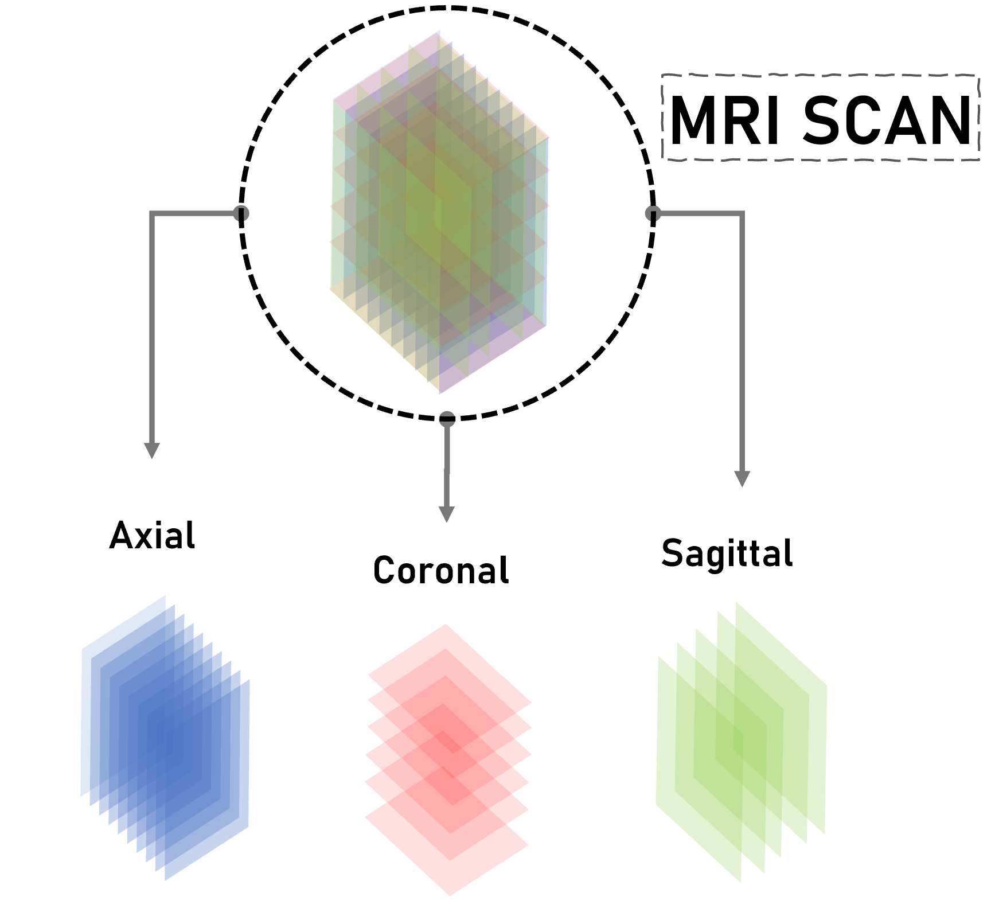
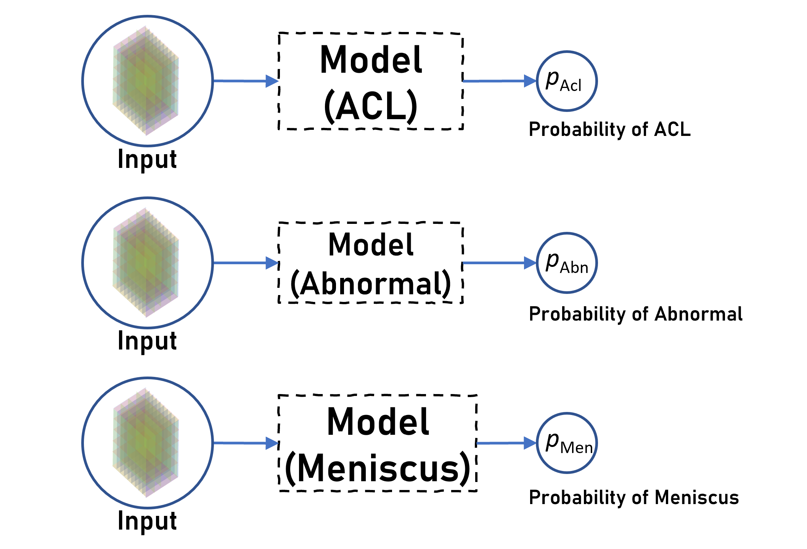

# Stanford MRNet Challenge: Classifying Knee MRIs

**This repository contains code for [Stanford MRNet Challenge: Classifying Knee MRIs](https://www.learnopencv.com/stanford-mrnet-challenge-classifying-knee-mris/) blogpost**.

<div align="center">


For details about the dataset and the competition, refer to https://stanfordmlgroup.github.io/competitions/mrnet/

</div>

[](https://www.dropbox.com/sh/0jy7h1b4yj1elgn/AAAnStaGub3S4vJF9Blm8mtta?dl=1)

<!-- # Install dependencies
1. `pip install git+https://github.com/ncullen93/torchsample`
2. `pip install nibabel`
3. `pip install sklearn`
4. `pip install pandas`

Install other dependencies as per requirement -->

# Installation and Getting Started
1. Clone the repository.

2. Set up the python(3.7) environment. I prefer conda. Given below is how to create a conda environment by the name `mrnet`
```Shell
$ conda create -n mrnet python=3.7
$ conda activate mrnet
```   
Make sure you are always inside the `mrnet` environment while working with this project.

3. Install dependencies. (You might want to select your virtual environment first)
```Shell
$ pip install -r requirements.txt
```    

4. Download the dataset (~5.7 GB), and put `train` and `valid` folders along with all the the `.csv` files inside `images` folder at root directory. 
```Shell
  images/
      train/
          axial/
          sagittal/
          coronal/
      val/
          axial/
          sagittal/
          coronal/
      train-abnormal.csv
      train-acl.csv
      train-meniscus.csv
      valid-abnormal.csv
      valid-acl.csv
      valid-meniscus.csv
```      

5. Make a new folder called `weights` at root directory, and inside the `weights` folder create three more folders namely `acl`, `abnormal` and `meniscus`.
```Shell
$ mkdir weights
$ cd weights
$ mkdir abnormal meniscus acl
$ cd ..
```      

6. All the hyperparameters are defined in `config.py` file. Feel free to play around those. Especially change the `task` to train on different diseases.

7. Now finally run the training using `python train.py`. All the logs for tensorboard will be stored in the `runs` directory at the root of the project.

*  **Tensorboard** Use tensorboard to view the evaluation results. Run the following command. 

```Shell
$ tensorboard --logdir runs/
```

or if you are using a remote connection

```Shell
$ tensorboard --logdir runs/ --host= <host_ip_id>
```

# Understanding the Dataset

<div align="center">



</div>
  
The dataset contains MRIs of different people. Each MRI consists of multiple images.
Each MRI has data in 3 perpendicular planes. And each plane as variable number of slices.

Each slice is an `256x256` image

For example:

For `MRI 1` we will have 3 planes:

Plane 1- with 35 slices

Plane 2- with 34 slices

Place 3 with 35 slices

Each MRI has to be classisifed against 3 diseases.

Major challenge with while selecting the model structure was the inconsistency in the data. Although the image size remains constant , the number of slices per plane are variable within a single MRI and varies across all MRIs.

So we are proposing a model for each plane. For each model the `batch size` will be variable and equal to `number of slices in the plane of the MRI`. So training each model, we will get features for each plane.

We also plan to have 3 separate models for each disease. 

# Model Specifications

<div align="center">



</div>

We will be using Alexnet pretrained as a feature extractor. When we would have trained the 3 models on the 3 planes, we will use its feature extractor layer as an input to a `global` model for the final classification.

# Contributors
<p > 
  -- Neelabh Madan   
 <a href = https://github.com/neelabh17 target='blank'> </a>
<br>

-- Jatin Prakash <a href = https://github.com/bicycleman15 target='blank'> </a>

***
This contains the code for **Stanford MRNet Challenge**. For more information - visit [**Stanford MRNet Challenge**.](https://www.learnopencv.com/stanford-mrnet-challenge/)


# AI Courses by OpenCV

Want to become an expert in AI? [AI Courses by OpenCV](https://opencv.org/courses/) is a great place to start. 

<a href="https://opencv.org/courses/">
<p align="center"> 

</p>
</a>

