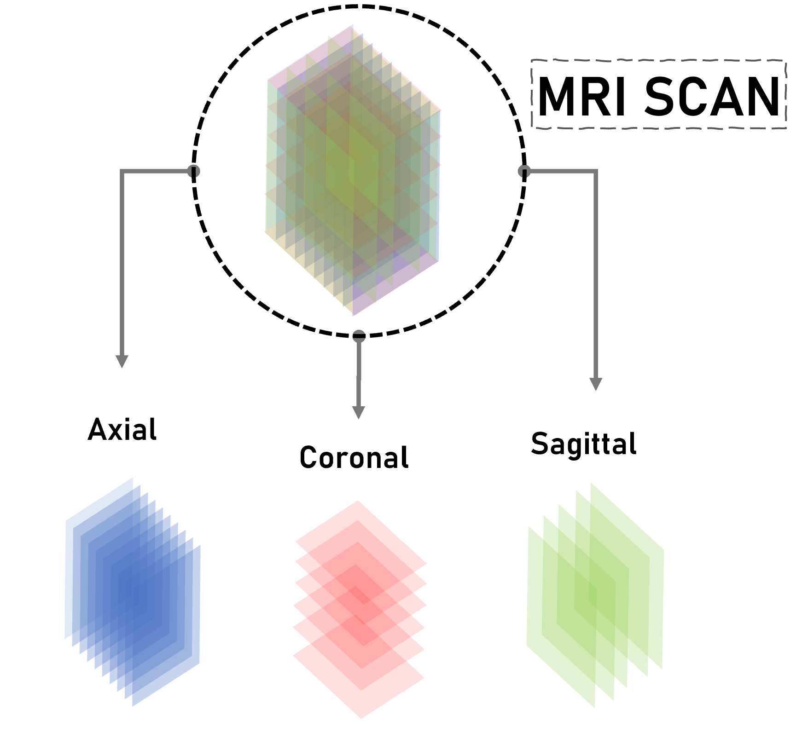
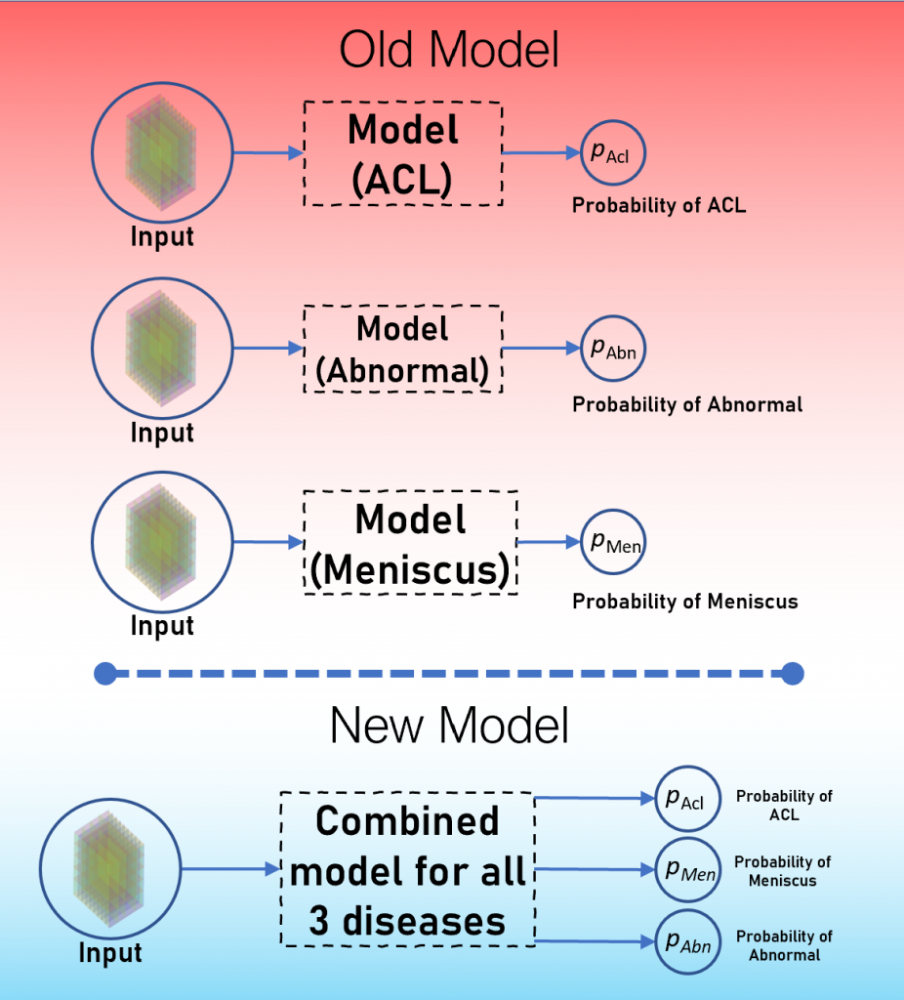

# Stanford MRnet Challenge

**This repository contains code for [MRNet – The Multi-Task Approach](https://learnopencv.com/mrnet-multitask-approach/) blogpost**.

<div align="center">


For more details refer to https://stanfordmlgroup.github.io/competitions/mrnet/.

</div>

[](https://www.dropbox.com/sh/65y1c1n13e7n1m9/AABvtFGLf2oXSvkixdEU8Szga?dl=1)

# Install dependencies
1. `pip install git+https://github.com/ncullen93/torchsample`
2. `pip install nibabel`
3. `pip install sklearn`
4. `pip install pandas`

Install other dependencies as per requirement.

# Instructions to run the training
1. Clone the repository.

2. Download the dataset (~5.7 GB), and put `train` and `valid` folders along with all the the `.csv` files inside `images` folder at root directory. 
```Shell
  images/
      train/
          axial/
          sagittal/
          coronal/
      val/
          axial/
          sagittal/
          coronal/
      train-abnormal.csv
      train-acl.csv
      train-meniscus.csv
      valid-abnormal.csv
      valid-acl.csv
      valid-meniscus.csv
```      

3. Make a new folder called `weights` at root directory, and inside the `weights` folder create three more folders namely `acl`, `abnormal` and `meniscus`.

4. All the hyperparameters are defined in `config.py` file. Feel free to play around those.

5. Now finally run the training using `python train.py`. All the logs for tensorboard will be stored in the `runs` directory at the root of the project.

# Understanding the Dataset

<div align="center">



</div>
  
The dataset contains MRIs of different people. Each MRI consists of multiple images.
Each MRI has data in 3 perpendicular planes. And each plane as variable number of slices.

Each slice is an `256x256` image

For example:

For `MRI 1` we will have 3 planes:

Plane 1- with 35 slices

Plane 2- with 34 slices

Place 3 with 35 slices

Each MRI has to be classisifed against 3 diseases.

Major challenge with while selecting the model structure was the inconsistency in the data. Although the image size remains constant , the number of slices per plane are variable within a single MRI and varies across all MRIs.

# Model Specifications

<div align="center">



</div>

In the last attempt to MRNet challenge, we used 3 different models for each disease, but instead we can leverage the information that the model learns for each of the disease and make inferencing for other disease better.

We used Hard Parameter sharing in this approach.

We will be using 3 Alexnet pretrained as 3 feature extractors for each of the plane. We then combine these feature extractor layers as an input to a `global` fully connected layer for the final classification.

# Contributors
<p > 
  -- Neelabh Madan   
 <a href = https://github.com/neelabh17 target='blank'> </a>
<br>

-- Jatin Prakash <a href = https://github.com/bicycleman15 target='blank'> </a>


