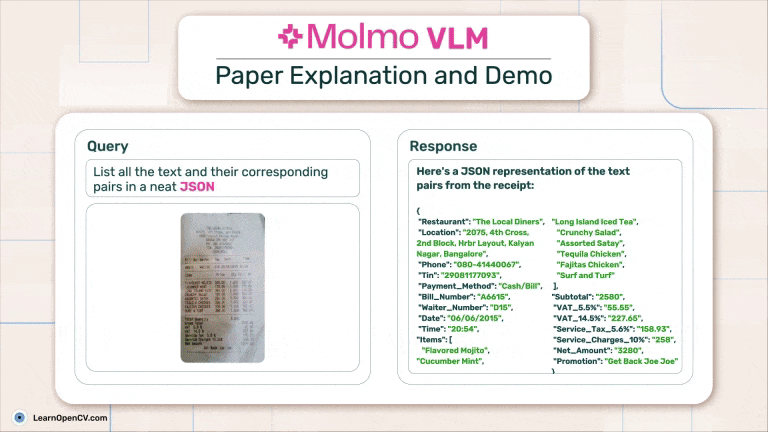

# Molmo VLM: Paper Explanation and Demo

**This repository contains code for [Molmo VLM: Paper Explanation and Demo](https://learnopencv.com/molmo-vlm) blogpost**.

## AI Courses by OpenCV

Want to become an expert in AI? [AI Courses by OpenCV](https://opencv.org/courses/) is a great place to start.

