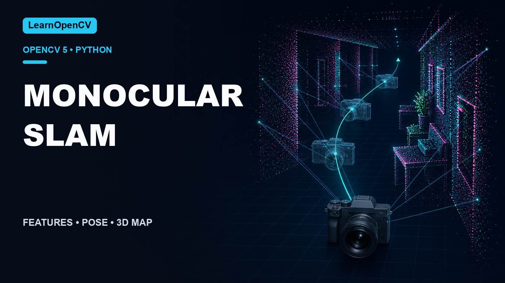

# Monocular SLAM in Python with OpenCV

[](https://learnopencv.com/monocular-slam-in-python/)

[](https://github.com/spmallick/learnopencv/releases/download/monocular-slam-opencv-2026.07.25/monocular-slam-opencv-2026.07.25.zip)

This is the companion implementation for
[Monocular SLAM in Python](https://learnopencv.com/monocular-slam-in-python/).
It is an educational monocular visual-odometry front end: ORB descriptors,
two-view pose recovery, sparse triangulation, a top-down trajectory, and a PLY
point cloud.

The 2026 refresh removes the old Pangolin, OpenGL, `g2o`, and `scikit-image`
runtime requirements. Pose estimation and triangulation now use OpenCV
directly, and every run can be validated without a display.

## Compatibility

| Component | Supported versions |
|---|---|
| Python | 3.10+ |
| OpenCV | 4.14.0 and 5.0.0 |
| NumPy | 1.26–2.x |

## Setup

```bash
python3 -m venv .venv
source .venv/bin/activate
python -m pip install -r requirements.txt
```

## Run

The bundled driving clip is used when `--input` is omitted.

```bash
python main.py \
  --max-frames 60 \
  --output-dir outputs \
  --no-display \
  --validate
```

An interactive run is simply:

```bash
python main.py
```

Useful options:

- `--input`: source video
- `--width`: processing width; default `960`
- `--focal-length`: pinhole focal length in pixels; default `450`
- `--max-frames`: limit processing; `0` means the whole video
- `--no-display`: headless execution
- `--validate`: check pose, map, and output invariants

## Outputs

- `outputs/slam-trajectory.png`: top-down camera trajectory
- `outputs/slam-feature-tracks.png`: inlier feature motion
- `outputs/slam-map.ply`: sparse triangulated point cloud

## Tests

```bash
python -m pytest -q tests
```

The regression test checks a real multi-frame run, finite homogeneous camera
poses, successful pose updates, a non-empty point cloud, and readable output
images.

## Project structure

```text
├── display.py
├── extractor.py
├── main.py
├── pointmap.py
├── requirements.txt
├── tests/
│   └── test_slam.py
├── videos/
└── notebooks/
```

The notebooks remain historical learning resources. The supported application
path is `main.py`; it no longer needs the legacy visualization or bundle
adjustment stack.

## Versioned download

The `monocular-slam-opencv-2026.07.25` GitHub Release contains the tested
project archive and its `SHA256SUMS.txt` checksum manifest.

---

<p align="center">
  <a href="https://bigvision.ai/">
    
  </a>
</p>

<h2 align="center">Build Production-Ready Computer Vision &amp; AI Solutions</h2>

<p align="center">
  LearnOpenCV is maintained by <a href="https://bigvision.ai/"><strong>BigVision.AI</strong></a>, a computer vision and AI consulting company. We help organizations design, build, optimize, and deploy production-ready AI solutions. Our team has deep expertise in computer vision, deep learning, multimodal AI, and edge deployment, with experience solving complex technical challenges across industries.
</p>

<p align="center">
  Have a project in mind? Talk with our expert AI solution builders.
</p>

<p align="center">
  <a href="https://bigvision.ai/expert-ai-solution-builders?utm_source=locv-github">
    
  </a>
</p>
