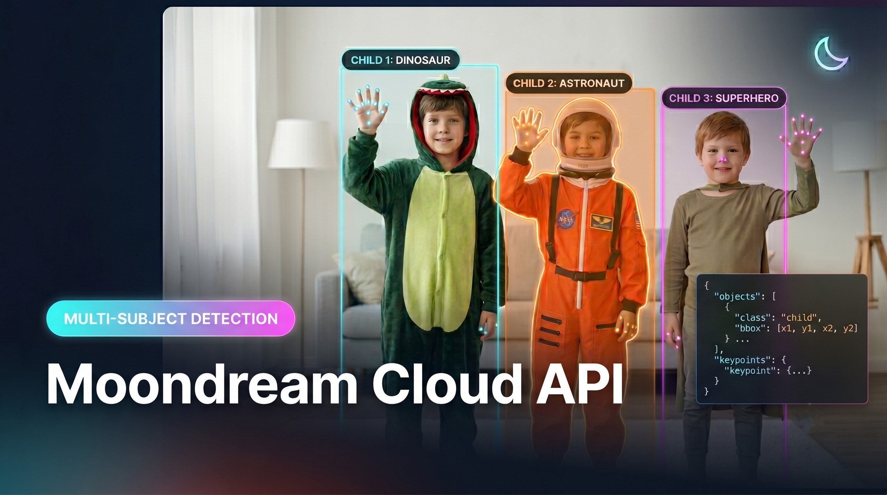

# Moondream Cloud API: One Image, Five Grounded Vision Skills

**This folder contains the Jupyter Notebook for the LearnOpenCV blog post [How to Unlock 5 Vision Skills with the Moondream Cloud API](<BLOG_POST_URL>).**

[](<BLOG_POST_URL>)

In `Moondream3.ipynb`, we run all five Moondream Cloud skills on a single image of three children in costume:

- **`caption`** — short, normal, and long descriptions
- **`query`** — a structured, left-to-right costume breakdown in JSON
- **`detect`** — bounding boxes for `person`, `fairy wings`, and `tiara`
- **`point`** — fine-grained locations for every `raised hand` and the `superman logo`
- **`segment`** — a precise mask for the rightmost child, reusing the `detect` box as a spatial reference

## Installation

The notebook auto-installs its dependencies on first run. To install them manually:

```bash
pip install requests pillow matplotlib
```

## Usage

1. Get a Moondream Cloud API key from the [Moondream Console](https://moondream.ai/).
2. Set it as an environment variable (never hard-code it in the notebook):

   ```bash
   # macOS / Linux
   export MOONDREAM_API_KEY="your_api_key_here"

   # Windows (PowerShell)
   setx MOONDREAM_API_KEY "your_api_key_here"
   ```

3. Launch the notebook:

   ```bash
   jupyter notebook Moondream3.ipynb
   ```

The demo image is downloaded from LearnOpenCV at runtime, so no local image file is needed.

# AI Courses by OpenCV

Want to become an expert in AI? [AI Courses by OpenCV](https://opencv.org/courses/) is a great place to start.

<a href="https://opencv.org/courses/">
<p align="center">

</p>
</a>
