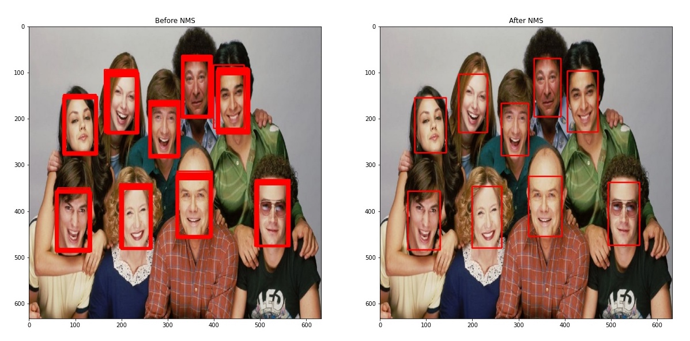

# Non Maximum Suppression: Theory and Implementation in PyTorch

**This repository contains code for [Non Maximum Suppression: Theory and Implementation in PyTorch](https://learnopencv.com/non-maximum-suppression-theory-and-implementation-in-pytorch) blogpost**.

[Open Notebook in Google Colab](https://colab.research.google.com/github/spmallick/learnopencv/blob/master/Non-Maximum-Suppression/nms_pytorch.ipynb)

## Sample Result

# AI Courses by OpenCV

Want to become an expert in AI? [AI Courses by OpenCV](https://opencv.org/courses/) is a great place to start. 

<a href="https://opencv.org/courses/">

 

</a>
