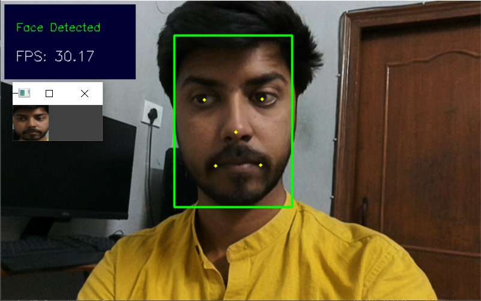

# DepthAI Pipeline Overview: Creating a Complex Pipeline

**This repository contains code for [DepthAI Pipeline Overview: Creating a Complex Pipeline](https://learnopencv.com/depthai-pipeline-overview-creating-a-complex-pipeline/) blogpost**.

[](https://www.dropbox.com/sh/oon2rklwhfmjkfd/AACsZN5WOjYRLIfOPL521108a?dl=1)


## Install Requirements
```
pip install -r requirements.txt
```

## Run Script after connecting the OAK-D device
```
python Face-detection-and-landmarks.py
```

## Sample Output



# AI Courses by OpenCV

Want to become an expert in AI? [AI Courses by OpenCV](https://opencv.org/courses/) is a great place to start. 

<a href="https://opencv.org/courses/">
<p align="center"> 

</p>
</a>
