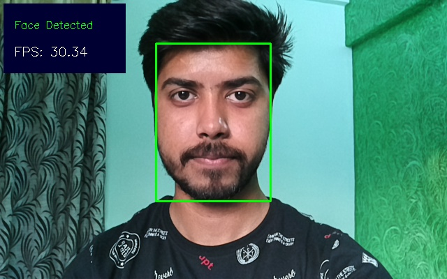
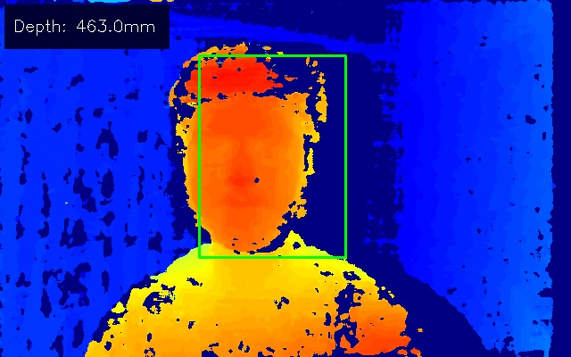

# Object detection with depth measurement using pre-trained models with OAK-D

**This repository contains code for [Object detection with depth measurement using pre-trained models with OAK-D](https://learnopencv.com/object-detection-with-depth-measurement-with-oak-d/) blogpost**.


## Install requirements

[](https://www.dropbox.com/sh/gnsv3fj9qxgzzcq/AADFKAjEHlMtWDR5ADBpNzdBa?dl=1)

```
pip install -r requirements.txt
```

## Run Script after connecting the OAK-D device
```
python spacial_face_det.py
```

## Sample Output





# AI Courses by OpenCV

Want to become an expert in AI? [AI Courses by OpenCV](https://opencv.org/courses/) is a great place to start. 

<a href="https://opencv.org/courses/">
<p align="center"> 

</p>
</a>
