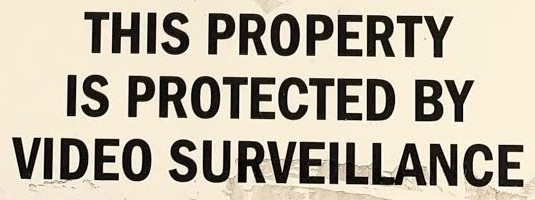

# [OCR Text Recognition with Tesseract 5 and OpenCV](https://learnopencv.com/deep-learning-based-text-recognition-ocr-using-tesseract-and-opencv/)

<p align="center">
  <a href="https://learnopencv.com/deep-learning-based-text-recognition-ocr-using-tesseract-and-opencv/">
    
  </a>
</p>

[](https://github.com/spmallick/learnopencv/releases/download/tesseract-ocr-opencv-2026.07.27/OCR-2026.07.27.zip)

This project uses OpenCV for image loading and optional grayscale, Otsu, or
adaptive-threshold preprocessing, then uses Tesseract 5 for recognition. The
Python example calls the installed Tesseract executable directly, avoiding a
second wrapper dependency. The C++ example uses `tesseract::TessBaseAPI` with
safe resource handling and converts BGR input to RGB before OCR.

## Requirements

- Python 3.10 or newer
- NumPy 2.0 or newer
- OpenCV 4.8 or newer, including OpenCV 5.x
- Tesseract 5.x with the required language data
- CMake 3.16, `pkg-config`, and a C++17 compiler for the native example

Verify the installed engine and languages:

```bash
tesseract --version
tesseract --list-langs
```

The tested environments were Python 3.14.3 with OpenCV-Python 4.13.0, exact
native OpenCV 4.13.0 with AppleClang 21, official OpenCV 5.0.0 in Python and C++, and
Tesseract 5.5.1 with English trained data.

## Python

```bash
python -m pip install -r requirements.txt
python ocr_simple.py images/road-sign-3.jpg \
  --preprocess gray \
  --psm 6 \
  --output output/road-sign.txt \
  --save-preprocessed output/road-sign-gray.png
```

Preprocessing choices are `none`, `gray`, `otsu`, and `adaptive`. Page
segmentation mode 6 assumes a uniform text block; mode 7 is a better starting
point for a single text line. Recognition quality still depends on resolution,
focus, contrast, orientation, layout, language data, and font.

## C++

```bash
cmake -S . -B build -DCMAKE_BUILD_TYPE=Release
cmake --build build --parallel
./build/ocr_simple images/road-sign-3.jpg \
  --preprocess gray \
  --psm 6
```

The shell-only comparison remains available:

```bash
./ocr_simple.sh images/road-sign-3.jpg eng 6
```

To build against OpenCV 5 explicitly:

```bash
cmake -S . -B build \
  -DOpenCV_DIR=/path/to/opencv/lib/cmake/opencv5
```

## Tests

```bash
python -m unittest discover -s tests -v
ctest --test-dir build --output-on-failure
```

The Python suite checks all preprocessing modes, recognizes a deterministic
synthetic line, validates the bundled road sign, and rejects invalid modes.
CTest runs the C++ road-sign regression. The same four Python tests and one C++
smoke test passed with OpenCV 4 and exact OpenCV 5.0.0.

## Project layout

```text
OCR/
├── CMakeLists.txt
├── README.md
├── images/
│   ├── computer-vision.jpg
│   ├── receipt.png
│   └── road-sign-1.jpg ... road-sign-3.jpg
├── ocr_simple.cpp
├── ocr_simple.py
├── ocr_simple.sh
├── requirements.txt
└── tests/
    └── test_ocr_simple.py
```

---

<p align="center">
  <a href="https://bigvision.ai/">
    
  </a>
</p>

<h2 align="center">Build Production-Ready Computer Vision &amp; AI Solutions</h2>

<p align="center">
  LearnOpenCV is maintained by <a href="https://bigvision.ai/"><strong>BigVision.AI</strong></a>, a computer vision and AI consulting company. We help organizations design, build, optimize, and deploy production-ready AI solutions. Our team has deep expertise in computer vision, deep learning, multimodal AI, and edge deployment, with experience solving complex technical challenges across industries.
</p>

<p align="center">
  Have a project in mind? Talk with our expert AI solution builders.
</p>

<p align="center">
  <a href="https://bigvision.ai/expert-ai-solution-builders?utm_source=locv-github">
    
  </a>
</p>
