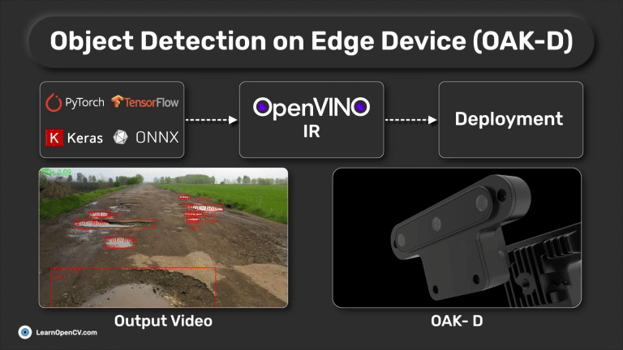

# Object Detection on Edge Device

**This repository contains code for [Object Detection on Edge Device - OAK-D-Lite](https://learnopencv.com/object-detection-on-edge-device) blogpost**.

---

# AI Courses by OpenCV

Want to become an expert in AI? [AI Courses by OpenCV](https://opencv.org/courses/) is a great place to start. 

<a href="https://opencv.org/courses/">

 

</a>

