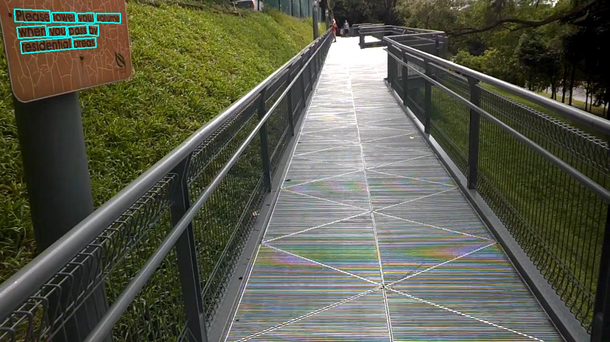

# EAST

- [1. Introduction](#1)
- [2. Environment](#2)
- [3. Model Training / Evaluation / Prediction](#3)
    - [3.1 Training](#3-1)
    - [3.2 Evaluation](#3-2)
    - [3.3 Prediction](#3-3)
- [4. Inference and Deployment](#4)
    - [4.1 Python Inference](#4-1)
    - [4.2 C++ Inference](#4-2)
    - [4.3 Serving](#4-3)
    - [4.4 More](#4-4)
- [5. FAQ](#5)

<a name="1"></a>
## 1. Introduction

Paper:
> [EAST: An Efficient and Accurate Scene Text Detector](https://arxiv.org/abs/1704.03155)
> Xinyu Zhou, Cong Yao, He Wen, Yuzhi Wang, Shuchang Zhou, Weiran He, Jiajun Liang
> CVPR, 2017


On the ICDAR2015 dataset, the text detection result is as follows:

|Model|Backbone|Configuration|Precision|Recall|Hmean|Download|
| --- | --- | --- | --- | --- | --- | --- |
|EAST|ResNet50_vd|88.71%|    81.36%|    84.88%|    [训练模型](https://paddleocr.bj.bcebos.com/dygraph_v2.0/en/det_r50_vd_east_v2.0_train.tar)|
|EAST|    MobileNetV3| 78.2%|    79.1%|    78.65%|    [训练模型](https://paddleocr.bj.bcebos.com/dygraph_v2.0/en/det_r50_vd_east_v2.0_train.tar)|


<a name="2"></a>
## 2. Environment
Please prepare your environment referring to [prepare the environment](./environment_en.md) and [clone the repo](./clone_en.md).


<a name="3"></a>
## 3. Model Training / Evaluation / Prediction

The above EAST model is trained using the ICDAR2015 text detection public dataset. For the download of the dataset, please refer to [ocr_datasets](./dataset/ocr_datasets_en.md).

After the data download is complete, please refer to [Text Detection Training Tutorial](./detection_en.md) for training. PaddleOCR has modularized the code structure, so that you only need to **replace the configuration file** to train different detection models.


<a name="4"></a>
## 4. Inference and Deployment


<a name="4-1"></a>
### 4.1 Python Inference

First, convert the model saved in the EAST text detection training process into an inference model. Taking the model based on the Resnet50_vd backbone network and trained on the ICDAR2015 English dataset as example ([model download link](https://paddleocr.bj.bcebos.com/dygraph_v2.0/en/det_r50_vd_east_v2.0_train.tar)), you can use the following command to convert:

```shell
python3 tools/export_model.py -c configs/det/det_r50_vd_east.yml -o Global.pretrained_model=./det_r50_vd_east_v2.0_train/best_accuracy  Global.save_inference_dir=./inference/det_r50_east/
```

For EAST text detection model inference, you need to set the parameter --det_algorithm="EAST", run the following command:
```shell
python3 tools/infer/predict_det.py --image_dir="./doc/imgs_en/img_10.jpg" --det_model_dir="./inference/det_r50_east/" --det_algorithm="EAST"
```


The visualized text detection results are saved to the `./inference_results` folder by default, and the name of the result file is prefixed with 'det_res'.




<a name="4-2"></a>
### 4.2 C++ Inference

Since the post-processing is not written in CPP, the EAST text detection model does not support CPP inference.

<a name="4-3"></a>
### 4.3 Serving

Not supported

<a name="4-4"></a>
### 4.4 More

Not supported

<a name="5"></a>
## 5. FAQ


## Citation

```bibtex
@inproceedings{zhou2017east,
  title={East: an efficient and accurate scene text detector},
  author={Zhou, Xinyu and Yao, Cong and Wen, He and Wang, Yuzhi and Zhou, Shuchang and He, Weiran and Liang, Jiajun},
  booktitle={Proceedings of the IEEE conference on Computer Vision and Pattern Recognition},
  pages={5551--5560},
  year={2017}
}
```
