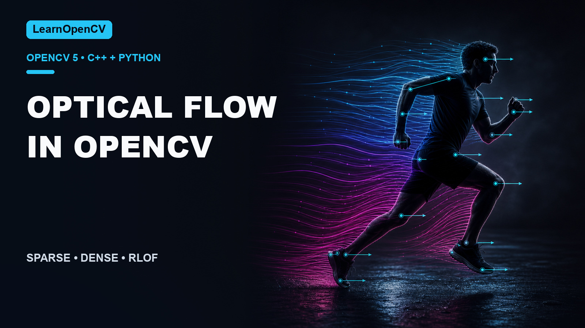

# Optical Flow in OpenCV: Sparse and Dense Methods

[](https://learnopencv.com/optical-flow-in-opencv/)

[](https://github.com/spmallick/learnopencv/releases/download/optical-flow-opencv-2026.07.25/optical-flow-opencv-2026.07.25.zip)

This folder accompanies
[Optical Flow in OpenCV](https://learnopencv.com/optical-flow-in-opencv/).
The Python and C++ demos share four algorithm names and support interactive or
headless execution.

| Name | Method | Output |
|---|---|---|
| `lucaskanade` | Sparse pyramidal Lucas–Kanade | Feature tracks |
| `lucaskanade_dense` | Dense grid of Lucas–Kanade tracks | HSV flow view |
| `farneback` | Dense Farnebäck flow | HSV flow view |
| `rlof` | Dense RLOF from OpenCV contrib | HSV flow view |

## Compatibility

| Path | Requirements |
|---|---|
| Python | Python 3.10+, `opencv-contrib-python` 4.14.0 or 5.0.0 |
| C++ | CMake 3.16+, C++17, OpenCV + contrib 4.14.0 or 5.0.0 |

## Python

```bash
python3 -m venv .venv
source .venv/bin/activate
python -m pip install -r requirements.txt
```

Run one validated headless example:

```bash
python demo.py \
  --algorithm farneback \
  --video videos/people.mp4 \
  --max-frames 12 \
  --output-dir outputs \
  --no-display \
  --validate
```

Replace `farneback` with any name from the table. `--video_path` remains an
alias for older commands.

## C++

```bash
cmake -S algorithms -B build -DCMAKE_BUILD_TYPE=Release
cmake --build build --parallel
./build/OpticalFlow \
  --algorithm farneback \
  --video videos/people.mp4 \
  --max-frames 12 \
  --output-dir outputs \
  --no-display \
  --validate
```

For a nonstandard OpenCV install, pass its package directory with
`-DOpenCV_DIR=...`.

## Outputs and tests

Each run saves the final visualization as
`outputs/<algorithm>-optical-flow.png`. Validation checks that at least one
frame pair was processed, motion is finite and nonzero, and the saved output is
readable.

```bash
python -m pytest -q tests
ctest --test-dir build --output-on-failure
```

## Versioned download

The `optical-flow-opencv-2026.07.25` GitHub Release contains the tested project
archive and its `SHA256SUMS.txt` checksum manifest.


---

<p align="center">
  <a href="https://bigvision.ai/">
    
  </a>
</p>

<h2 align="center">Build Production-Ready Computer Vision &amp; AI Solutions</h2>

<p align="center">
  LearnOpenCV is maintained by <a href="https://bigvision.ai/"><strong>BigVision.AI</strong></a>, a computer vision and AI consulting company. We help organizations design, build, optimize, and deploy production-ready AI solutions. Our team has deep expertise in computer vision, deep learning, multimodal AI, and edge deployment, with experience solving complex technical challenges across industries.
</p>

<p align="center">
  Have a project in mind? Talk with our expert AI solution builders.
</p>

<p align="center">
  <a href="https://bigvision.ai/expert-ai-solution-builders?utm_source=locv-github">
    
  </a>
</p>
