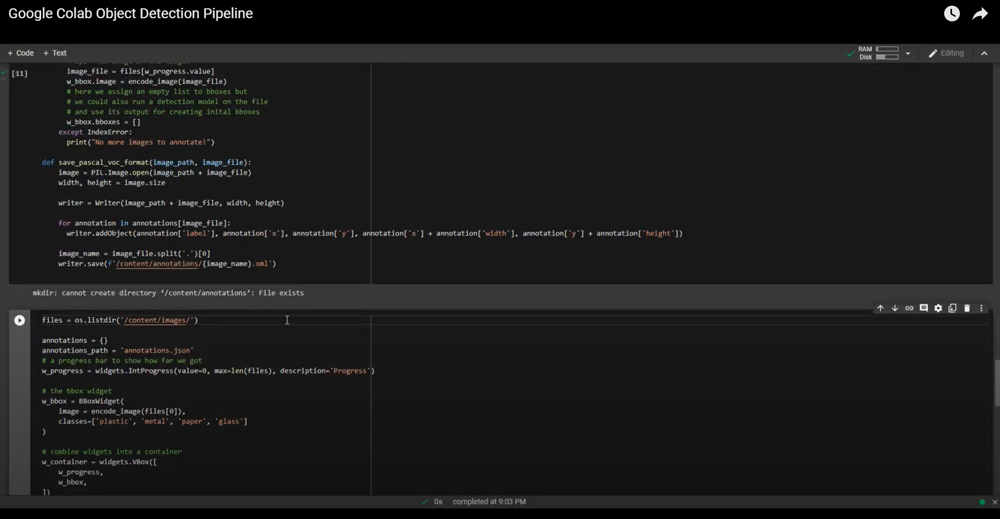
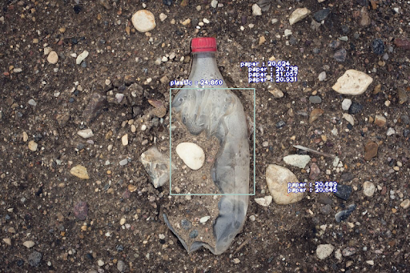

# Plastic Waste Detection with Deep Learning

**This repository contains code for [Plastic waste detection with deep learning](https://learnopencv.com/plastic-waste-detection-with-deep-learning/) blogpost**.

  

## Instructions

### Demo video running the colab notebooks  

### Image Web Scraper and Annotation Tool  

### Model Trainer and Testing   

## Sample Object Detection Output

# AI Courses by OpenCV

Want to become an expert in AI? [AI Courses by OpenCV](https://opencv.org/courses/) is a great place to start. 

<a href="https://opencv.org/courses/">

 

</a>
