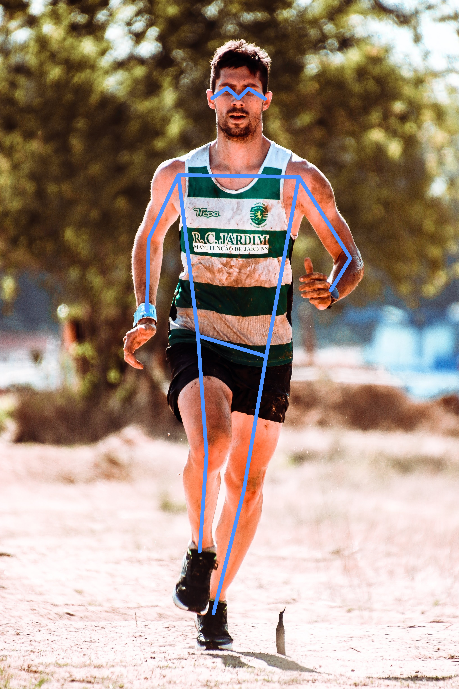

# Human Pose Estimation using Keypoint RCNN in PyTorch

**This repository contains code for [Human Pose Estimation using Keypoint RCNN in PyTorch](https://learnopencv.com/human-pose-estimation-using-keypoint-rcnn-in-pytorch/) blogpost**.

[](https://www.dropbox.com/sh/5odutr2eofs2jd2/AACv99eMMOO8I9gsxx6R0_mqa?dl=1)

[](https://colab.research.google.com/github/spmallick/learnopencv/blob/master/PyTorch-Keypoint-RCNN/run_pose_estimation.ipynb)

## Directory Structure

**All the code files and folders follow the following structure.**

```

├── images
│   ├── image_1.png
│    
├── run_keypoint_rcnn.py
├── run_keypoint_rcnn.ipynb
├── requirements.txt
│       
└── README.md
```


## Instructions


To run the Python script, execute `python run_pose_estimation.py`

To run the jupyter notebook, open it in a Jupyter console and run cells sequentially.


## Human Pose Estimation Output




# AI Courses by OpenCV

Want to become an expert in AI? [AI Courses by OpenCV](https://opencv.org/courses/) is a great place to start.

[](https://opencv.org/courses/)
