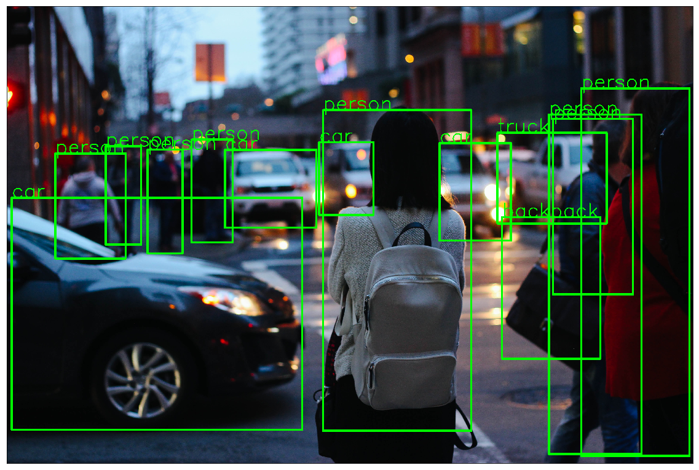

# Faster R-CNN Object Detection with PyTorch

## Read the Blog 
LearnOpenCV Blog : [Faster R-CNN Object Detection with PyTorch](https://www.learnopencv.com/faster-r-cnn-object-detection-with-pytorch)

## Notebook
Jupyter Notebook : [Notebook](PyTorch_faster_RCNN.ipynb)

# AI Courses by OpenCV

Want to become an expert in AI? [AI Courses by OpenCV](https://opencv.org/courses/) is a great place to start. 

<a href="https://opencv.org/courses/">

 

</a>
