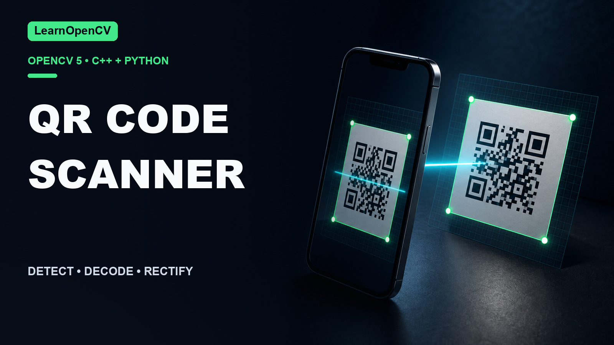

# OpenCV QR Code Scanner in C++ and Python

[](https://learnopencv.com/opencv-qr-code-scanner-c-and-python/)

This folder accompanies
[OpenCV QR Code Scanner in C++ and Python](https://learnopencv.com/opencv-qr-code-scanner-c-and-python/).
Both implementations use `cv::QRCodeDetector` / `cv2.QRCodeDetector` to
detect, decode, draw the four corners, and save the rectified code.

## Compatibility

| Path | Requirements |
|---|---|
| Python | Python 3.10+, OpenCV 4.14.0 or 5.0.0 |
| C++ | CMake 3.16+, C++17, OpenCV 4.14.0 or 5.0.0 |

## Python

```bash
python3 -m venv .venv
source .venv/bin/activate
python -m pip install -r requirements.txt
python qrCodeOpencv.py --no-display --validate
```

The bundled QR image is the default. Use `--input path/to/code.png` for another
image and `--output-dir results` to change the output directory.

The optional ZBar comparison is isolated because `pyzbar` also needs the native
ZBar library:

```bash
python -m pip install -r requirements-zbar.txt
python zbar-opencv-comparison.py --input qrcode-learnopencv.jpg
```

## C++

```bash
cmake -S . -B build -DCMAKE_BUILD_TYPE=Release
cmake --build build --parallel
./build/qrCodeOpencv --no-display --validate
```

For a nonstandard OpenCV installation, add
`-DOpenCV_DIR=/path/to/lib/cmake/opencv4` (OpenCV 4.14) or the corresponding
OpenCV 5 package directory.

## Outputs and validation

- `outputs/qr-code-annotated.png`: detected quadrilateral
- `outputs/qr-code-rectified.png`: straightened binary code

`--validate` checks the known payload, exactly four corners, and a non-empty
rectified image.

```bash
python -m pytest -q tests
ctest --test-dir build --output-on-failure
```

## Versioned download

The `qr-code-scanner-opencv-2026.07.25` GitHub Release contains the tested
project archive and its `SHA256SUMS.txt` checksum manifest.


---

<p align="center">
  <a href="https://bigvision.ai/">
    
  </a>
</p>

<h2 align="center">Build Production-Ready Computer Vision &amp; AI Solutions</h2>

<p align="center">
  LearnOpenCV is maintained by <a href="https://bigvision.ai/"><strong>BigVision.AI</strong></a>, a computer vision and AI consulting company. We help organizations design, build, optimize, and deploy production-ready AI solutions. Our team has deep expertise in computer vision, deep learning, multimodal AI, and edge deployment, with experience solving complex technical challenges across industries.
</p>

<p align="center">
  Have a project in mind? Talk with our expert AI solution builders.
</p>

<p align="center">
  <a href="https://bigvision.ai/expert-ai-solution-builders?utm_source=locv-github">
    
  </a>
</p>
