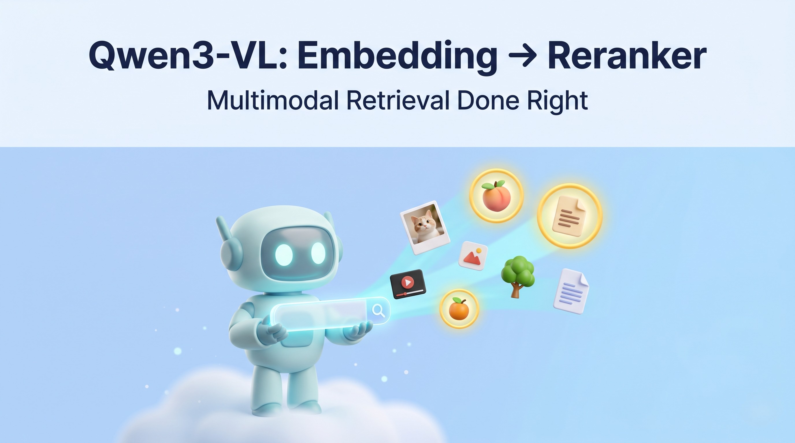

# Qwen3-VL Embedding & Reranker: Multimodal Retrieval Done Right



This folder contains the code and assets for the LearnOpenCV blog post on **Qwen3-VL-Embedding** and **Qwen3-VL-Reranker** — Alibaba's January 2026 open-source multimodal retrieval suite. The two models are designed as a pair: the Embedding model gives every item (text, image, screenshot, video, or a mix) a 2048-dim vector for fast first-stage recall, and the Reranker takes `(query, document)` pairs and returns precise relevance scores in `[0, 1]` for second-stage refinement.

📝 **Blog post:** [Qwen3-VL Embedding and Reranker on LearnOpenCV](https://learnopencv.com/qwen3-vl-embedding-reranker/)

## What's inside

| File | Purpose |
|---|---|
| `Qwen3VL_Embedding_Reranker.ipynb` | End-to-end Colab-ready notebook covering 11 retrieval capabilities |
| `assets/` | 6 curated images and 4 short videos used by the notebook |
| `Qwen3-VL_Embedding_Reranker.jpg` | Blog thumbnail / hero image |

## Capabilities demonstrated in the notebook

1. Text-to-image retrieval (26-image corpus)
2. Image-to-image retrieval
3. Logo / screenshot / document retrieval
4. Mixed-modal queries (image + text in one input)
5. Short-video clip retrieval (middle-frame trick)
6. Video-to-video retrieval across a 4-clip corpus (full video API)
7. Instruction-aware retrieval
8. Multilingual queries (Hindi, Chinese, Spanish, French, English)
9. Pure text-to-text similarity
10. The two-stage Embedding → Reranker pipeline

## How to run

### Google Colab (recommended)

1. Open the notebook in Colab: [`Qwen3VL_Embedding_Reranker.ipynb`](https://colab.research.google.com/github/Sudip-329/learnopencv/blob/master/Qwen3-VL-Embedding-Reranker/Qwen3VL_Embedding_Reranker.ipynb)
2. Set the runtime to **T4 GPU** (`Runtime → Change runtime type → T4 GPU`).
3. Click `Runtime → Run all`. First run takes ~5 minutes (downloads ~7 GB of model weights, cached after).

### Local Jupyter

Requirements: Python 3.10+, CUDA GPU with at least 12 GB VRAM.

```bash
pip install "transformers>=4.57.0" "qwen-vl-utils>=0.0.14" \
            datasets pillow matplotlib accelerate \
            opencv-python-headless requests ipywidgets

git clone --depth 1 https://github.com/QwenLM/Qwen3-VL-Embedding.git
jupyter notebook Qwen3VL_Embedding_Reranker.ipynb
```

The notebook adds the cloned repo to `sys.path` so both `Qwen3VLEmbedder` and `Qwen3VLReranker` import from `src.models.*`.


## Models

- 🤗 [Qwen/Qwen3-VL-Embedding-2B](https://huggingface.co/Qwen/Qwen3-VL-Embedding-2B)
- 🤗 [Qwen/Qwen3-VL-Reranker-2B](https://huggingface.co/Qwen/Qwen3-VL-Reranker-2B)

## References

- 📄 Paper: [Qwen3-VL-Embedding and Qwen3-VL-Reranker (arXiv:2601.04720)](https://arxiv.org/abs/2601.04720)
- 💻 Code repo: [QwenLM/Qwen3-VL-Embedding](https://github.com/QwenLM/Qwen3-VL-Embedding)
- 🤗 Hugging Face collections: [Embedding](https://huggingface.co/collections/Qwen/qwen3-vl-embedding), [Reranker](https://huggingface.co/collections/Qwen/qwen3-vl-reranker)
