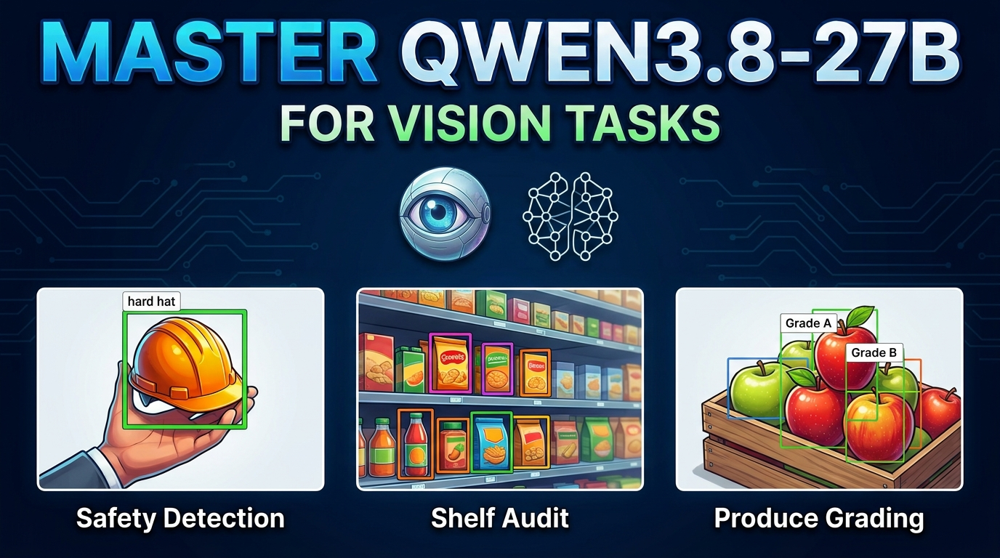

# How to Master Qwen3.8-27B for Real Computer Vision Tasks

**This repository contains the Colab notebook and sample assets for the LearnOpenCV blog post [How to Master Qwen3.8-27B for Real Computer Vision Tasks](ADD_BLOG_LINK_HERE).**

Qwen3.8-27B is an open, Apache-2.0 vision-language model from the Qwen3-VL family. This notebook is a hands-on tour that points it at real computer vision problems on Google Colab, so you switch tasks by rewriting a prompt instead of collecting a dataset and training a model.

## What the notebook covers

The model is loaded once in 4-bit (it fits a single A100) behind one reusable `ask()` helper, and every demo reuses that helper:

- **Detection and visual grounding** with drawn bounding boxes: workplace safety / PPE, retail shelf audit, traffic, and referring expressions
- **Zero-shot inspection and classification with an explanation**: manufacturing defects, crop disease grading, produce freshness, and fine-grained recognition
- **Video understanding**: clip summaries, action recognition, anomaly checks, and sports play-by-play
- **Multi-image reasoning** and before / after change detection
- **Scene and spatial reasoning** for assistive and robotics use
- **Damage and condition assessment**
- **Reading charts, diagrams, and signs**
- **Different styles and creative uses**, plus an honest look at where the model slips (counting, tiny text, approximate boxes)

## How to run

An A100 runtime (Colab Pro or Pro+) is recommended. Open the notebook in Colab and run it top to bottom. The first cells install the dependencies and download all the sample images and clips into an `assets/` folder automatically, so the notebook is self-contained.

## Folder contents

- `Qwen3_8_27B_Vision_Tour.ipynb` - the full notebook
- `assets/` - the sample images and video clips used by the demos

---

  

<h2 align="center">Build Production-Ready Computer Vision &amp; AI Solutions</h2>

  LearnOpenCV is maintained by <a href="https://bigvision.ai/"><strong>BigVision.AI</strong></a>, a computer vision and AI consulting company. We help organizations design, build, optimize, and deploy production-ready AI solutions. Our team has deep expertise in computer vision, deep learning, multimodal AI, and edge deployment, with experience solving complex technical challenges across industries.

  Have a project in mind? Talk with our expert AI solution builders.

  

