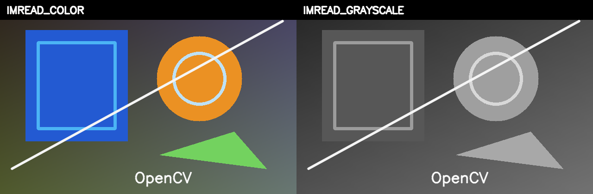

# [Read, Display, and Write Images with OpenCV in Python and C++](https://learnopencv.com/read-display-and-write-an-image-using-opencv/)

[](https://learnopencv.com/read-display-and-write-an-image-using-opencv/)

Modern, tested companion code for OpenCV `imread`, optional `imshow`, and `imwrite`. The examples check decode and encode failures, demonstrate explicit read flags, compare lossless PNG with quality-controlled JPEG, and run headlessly by default.

[](https://github.com/spmallick/learnopencv/releases/download/image-io-opencv-2026.07.27/Read-Write-Display-Image-OpenCV-2026.07.27.zip)

## Python

Requires Python 3.10+ and OpenCV 4.8 through 5.x.

```bash
python3 -m pip install -r requirements.txt
python3 image_io.py
python3 -m pytest -q
```

Add `--display` only when a desktop GUI is available. The program finds its bundled sample independently of the current working directory.

## C++17

```bash
cmake -S . -B build -DCMAKE_BUILD_TYPE=Release
cmake --build build --config Release
ctest --test-dir build --output-on-failure
./build/image_io
```

OpenCV 4.x or 5.x is supported with the `core`, `highgui`, `imgcodecs`, and `imgproc` modules.

## Expected outputs

`outputs/` receives a lossless PNG copy, grayscale PNG, JPEG at quality 90, and a labeled color/grayscale comparison. The tests require exact pixels for the PNG round trip and a bounded mean absolute error for JPEG because lossy codec output is not byte-stable across every build.

---

<p align="center">
  <a href="https://bigvision.ai/">
    
  </a>
</p>

<h2 align="center">Build Production-Ready Computer Vision &amp; AI Solutions</h2>

<p align="center">
  LearnOpenCV is maintained by <a href="https://bigvision.ai/"><strong>BigVision.AI</strong></a>, a computer vision and AI consulting company. We help organizations design, build, optimize, and deploy production-ready AI solutions. Our team has deep expertise in computer vision, deep learning, multimodal AI, and edge deployment, with experience solving complex technical challenges across industries.
</p>

<p align="center">
  Have a project in mind? Talk with our expert AI solution builders.
</p>

<p align="center">
  <a href="https://bigvision.ai/expert-ai-solution-builders?utm_source=locv-github">
    
  </a>
</p>
