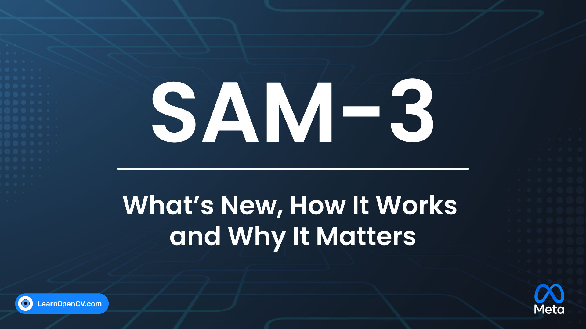

# SAM-3: What’s New, How It Works, and Why It Matters

This repository explores Meta's SAM-3 through a detailed technical blog post and a hands-on video inference script. The guide breaks down the architectural shift to "Promptable Concept Segmentation" (PCS), explaining how the model unifies detection, segmentation, and tracking. 

The accompanying Jupyter Notebook demonstrates how to implement video tracking using OpenCV and Python to track multiple concepts simultaneously in video streams using simple text prompts.  

It is part of the LearnOpenCV blog post - [SAM-3: What’s New, How It Works, and Why It Matters](https://learnopencv.com/sam-3-whats-new/).

## AI Courses by OpenCV

Want to become an expert in AI? [AI Courses by OpenCV](https://opencv.org/courses/) is a great place to start.

