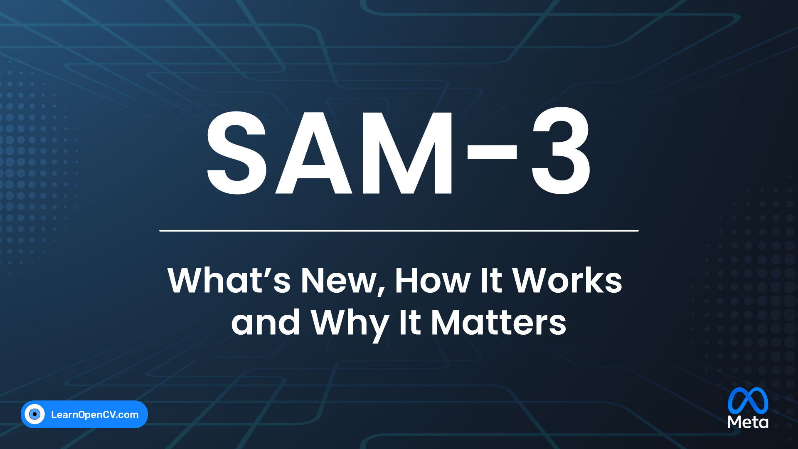

# [SAM-3: What’s New, How It Works, and Why It Matters](https://learnopencv.com/sam-3-whats-new/)

**Updated August 30, 2026:** This companion now uses Meta's SAM 3.1 Object
Multiplex video predictor. The previous notebook applied the image processor to
each frame independently, so it performed frame-by-frame concept segmentation
rather than stateful tracking.

[](https://learnopencv.com/sam-3-whats-new/)

[](https://github.com/spmallick/learnopencv/releases/download/sam-3-1-video-tracking-2026.08.30-r2/SAM-3.zip)

## What This Example Does

The script opens one SAM 3.1 inference session, supplies one text noun phrase,
and propagates the resulting object identities through the complete video.
OpenCV then renders a stable color and object ID for every returned mask. This
separation is important: SAM 3.1 performs the temporal tracking; OpenCV handles
video decoding and visualization.

A text prompt is one concept phrase, such as `person wearing a red shirt`.
Commas do not turn one string into a documented multi-label request. Run a
separate session when you need an independently defined concept.

## Requirements

Meta's current SAM 3.1 installation requires:

- Python 3.12 or newer
- PyTorch 2.7 or newer; Meta's current tested command installs PyTorch 2.10
- An NVIDIA CUDA GPU with CUDA 12.6 or newer
- Access to the gated `facebook/sam3.1` checkpoint on Hugging Face
- The latest code from Meta's official [SAM 3 repository](https://github.com/facebookresearch/sam3)
- FFmpeg and FFprobe when the source audio should be preserved

The optional FlashAttention 3 path can improve compatible GPU inference. The
example uses the portable attention path by default; pass `--fa3` only after
installing the optional kernels on a supported system.

The pinned Meta revision also has a documented multiplex-session argument
mismatch ([Meta issue #544](https://github.com/facebookresearch/sam3/issues/544)).
The companion detects that exact signature mismatch and filters only the
unsupported `offload_state_to_cpu` keyword during session creation. The guard
becomes a no-op when Meta's multiplex model accepts that argument upstream.

## Project Layout

```text
SAM-3/
├── .gitignore
├── README.md
├── featured_image_SAM_3.jpg
├── requirements.txt
├── sam3_inference.ipynb
├── sam3_video_tracking.py
└── tests/
    └── test_sam3_video_tracking.py
```

## Installation

Download this companion through the button above, extract `SAM-3.zip`, open a
terminal in the directory that contains the extracted folder, and enter it
once:

```bash
cd SAM-3
```

Every command and relative path below assumes `SAM-3` is the working directory.
Create the environment, install the current CUDA build of PyTorch, and keep the
pinned official Meta checkout under `vendor/` so the working directory does not
change:

```bash
conda create -n sam31 python=3.12
conda activate sam31

python -m pip install torch==2.10.0 torchvision \
  --index-url https://download.pytorch.org/whl/cu128

mkdir -p vendor
git clone https://github.com/facebookresearch/sam3.git vendor/sam3
git -C vendor/sam3 checkout 660a5e9e1b8b4c02c0ad97229b88a09a6e4ff5b7
python -m pip install -e "./vendor/sam3[notebooks]"
python -m pip install -r requirements.txt
hf auth login
```

## Run Stateful SAM 3.1 Tracking

```bash
python sam3_video_tracking.py \
  --video input.mp4 \
  --output output-sam31.mp4 \
  --prompt "person"
```

The first run downloads the SAM 3.1 checkpoint after Hugging Face access and
authentication have been configured. To use a local checkpoint instead:

```bash
python sam3_video_tracking.py \
  --video input.mp4 \
  --output output-sam31.mp4 \
  --prompt "person" \
  --checkpoint /path/to/sam3.1_multiplex.pt
```

By default, the renderer copies the source video's audio into the finished
file. Install FFmpeg for this step, or pass `--no-audio` when a silent output is
intentional.

The default Object Multiplex bucket contains 16 objects. Increase the overall
capacity while retaining 16-object buckets when a scene contains more tracked
instances:

```bash
python sam3_video_tracking.py \
  --video crowded-scene.mp4 \
  --output crowded-scene-sam31.mp4 \
  --prompt "person" \
  --max-objects 128 \
  --multiplex-count 16 \
  --compile
```

Compilation adds startup cost, so measure after warm-up and report the GPU,
object count, video resolution, and software versions with any speed result.

## Notebook

`sam3_inference.ipynb` teaches the same stateful flow in small steps. It imports
the tested functions from `sam3_video_tracking.py` rather than maintaining a
second implementation.

## Tests

Run the deterministic OpenCV and predictor-contract tests without downloading
a checkpoint:

```bash
python -m unittest discover -s tests -v
python -m py_compile sam3_video_tracking.py
```

These tests create small temporary videos, exercise the real renderer with a
fake predictor, verify session lifecycle requests, preserve a synthetic audio
stream when FFmpeg is available, keep the full video when audio ends early,
cover the pinned upstream session regression, and decode the result. They do
not measure SAM checkpoint accuracy or GPU performance; those require a
compatible CUDA system and the gated model.

## Important Limitations

- Stateful tracking mitigates drift and identity loss; it does not guarantee
  perfect recovery after occlusion or in crowded, visually similar scenes.
- The presence score and confidence threshold reduce false positives but still
  require validation on the deployment domain.
- One text string represents one phrase. Use separate sessions for unrelated
  concepts rather than a comma-separated pseudo-list.
- SAM 3.1's accuracy changes are benchmark-dependent. Its main release benefit
  is substantially better multi-object inference efficiency through Object
  Multiplex, not a universal accuracy increase.


---

<p align="center">
  <a href="https://bigvision.ai/">
    
  </a>
</p>

<h2 align="center">Build Production-Ready Computer Vision &amp; AI Solutions</h2>

<p align="center">
  LearnOpenCV is maintained by <a href="https://bigvision.ai/"><strong>BigVision.AI</strong></a>, a computer vision and AI consulting company. We help organizations design, build, optimize, and deploy production-ready AI solutions. Our team has deep expertise in computer vision, deep learning, multimodal AI, and edge deployment, with experience solving complex technical challenges across industries.
</p>

<p align="center">
  Have a project in mind? Talk with our expert AI solution builders.
</p>

<p align="center">
  <a href="https://bigvision.ai/expert-ai-solution-builders?utm_source=locv-github">
    
  </a>
</p>
