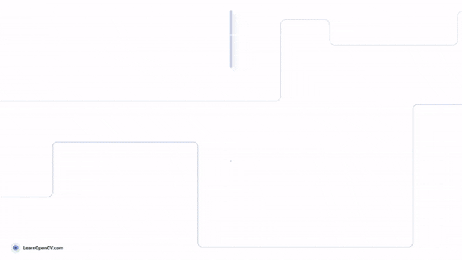

# SAM 2 – Promptable Segmentation for Images and Videos

This folder contains the Jupyter Notebooks and and images for the LearnOpenCV article  - **[SAM 2 - Segment Anything Model 2]([https://learnopencv.com/sam-2/](https://learnopencv.com/?p=57810))**.

You can download the custom code directory and images from the below link. After downloading, follow the steps in the article to clone and set up the official repository and then copy the `custom_code` folder into the cloned git directory.

## AI Courses by OpenCV

Want to become an expert in AI? [AI Courses by OpenCV](https://opencv.org/courses/) is a great place to start.

