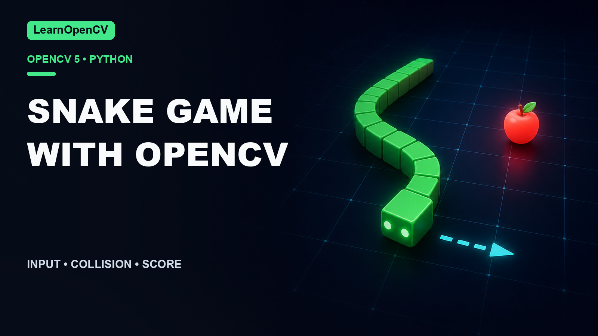

# Snake Game with OpenCV and Python

[](https://learnopencv.com/snake-game-with-opencv-python/)

[](https://github.com/spmallick/learnopencv/releases/download/snake-game-opencv-2026.07.25/snake-game-opencv-2026.07.25.zip)

This folder accompanies
[Snake Game with OpenCV and Python](https://learnopencv.com/snake-game-with-opencv-python/).
The game engine is now separate from OpenCV rendering, so movement, growth,
apple placement, collision handling, and score logic can be tested without a
display.

## Compatibility

- Python 3.10+
- OpenCV 4.14.0 or 5.0.0
- NumPy 1.26–2.x

## Setup

```bash
python3 -m venv .venv
source .venv/bin/activate
python -m pip install -r requirements.txt
```

## Play

```bash
python snake.py
```

Use W/A/S/D or the arrow keys. Press Esc or Q to quit.

Useful controls include `--board-size`, `--cell-size`, `--speed`, `--growth`,
and `--seed`.

## Headless validation

```bash
python snake.py \
  --no-display \
  --max-steps 24 \
  --output outputs/snake-final-board.png \
  --validate
```

This deterministic path exercises eating, growth, new-apple placement, wall
collision, and rendering before saving the final board.

```bash
python -m pytest -q tests
```

## Versioned download

The `snake-game-opencv-2026.07.25` GitHub Release contains the tested project
archive and its `SHA256SUMS.txt` checksum manifest.

---

<p align="center">
  <a href="https://bigvision.ai/">
    
  </a>
</p>

<h2 align="center">Build Production-Ready Computer Vision &amp; AI Solutions</h2>

<p align="center">
  LearnOpenCV is maintained by <a href="https://bigvision.ai/"><strong>BigVision.AI</strong></a>, a computer vision and AI consulting company. We help organizations design, build, optimize, and deploy production-ready AI solutions. Our team has deep expertise in computer vision, deep learning, multimodal AI, and edge deployment, with experience solving complex technical challenges across industries.
</p>

<p align="center">
  Have a project in mind? Talk with our expert AI solution builders.
</p>

<p align="center">
  <a href="https://bigvision.ai/expert-ai-solution-builders?utm_source=locv-github">
    
  </a>
</p>
