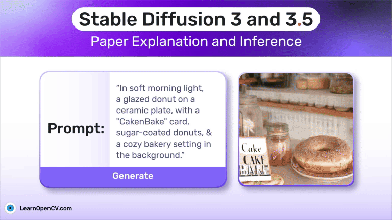

# Stable Diffusion 3 and 3.5: Paper Explanation and Inference

This repository contains the Notebook file  to run the Inference.   

It is part of the LearnOpenCV blog post - [Stable Diffusion 3 and 3.5: Paper Explanation and Inference](https://learnopencv.com/stable-diffusion-3/)

## AI Courses by OpenCV

Want to become an expert in AI? [AI Courses by OpenCV](https://opencv.org/courses/) is a great place to start.

