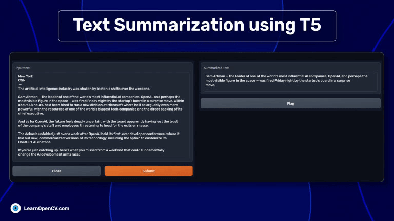

# Text Summarization using T5: Fine-Tuning and Building Gradio App

This folder contains the code for fine-tuning T5 for text summarization. It is part of the blog post [Text Summarization using T5: Fine-Tuning and Building Gradio App](https://learnopencv.com/text-summarization-using-t5/)

## AI Courses by OpenCV

Want to become an expert in AI? [AI Courses by OpenCV](https://opencv.org/courses/) is a great place to start.

