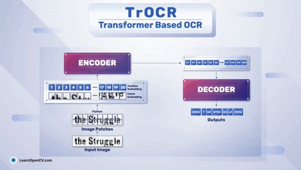

# TrOCR-Getting-Started-with-Transformer-Based-OCR

This folder contains the Jupyter Notebook for running inference using TrOCR. This is part of the LearnOpenCV blog post - [TrOCR - Getting Started with Transformer Based OCR](https://learnopencv.com/trocr-getting-started-with-transformer-based-ocr/).

The notebook is one-click runnable and the dataset will download automatically.

## AI Courses by OpenCV

Want to become an expert in AI? [AI Courses by OpenCV](https://opencv.org/courses/) is a great place to start.

