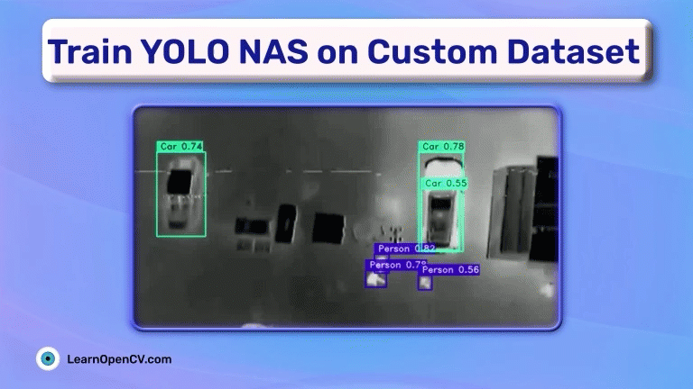

# README

This folder contains the notebooks for training YOLO NAS models on custom dataset. This is part of the blog post - [Train YOLO NAS on Custom Dataset](https://learnopencv.com/train-yolo-nas-on-custom-dataset/).

There are three notebooks in this folder:

* `YOLO_NAS_Fine_Tuning.ipynb`: For fine-tuning YOLO NAS Small, Medium, and Large models for 50 epochs.
* `YOLO_NAS_Large_Fine_Tining.ipynb`: For fine-tuning the Large model for 100 epochs.
* `inference.ipynb`: To carry out inference on the test set.

# AI Courses by OpenCV

Want to become an expert in AI? [AI Courses by OpenCV](https://opencv.org/courses/) is a great place to start.

