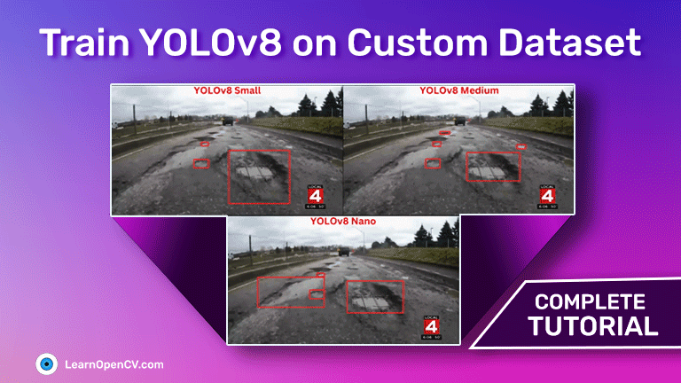

# README

This repository contains the notebooks and trained weights for the experiments shown in the blog post - [Train YOLOv8 on Custom Dataset - A Complete Tutorial](https://learnopencv.com/train-yolov8-on-custom-dataset).

The `yolov8_fine_tuning.ipynb` notebooks can be run end-to-end on local systems, Kaggle, and Colab. The datasets will be downloaded automatically.

Download the `weights.zip` file [**from here**](https://www.dropbox.com/s/5csa554niatn9ty/weights.zip?dl=1).

The `weights.zip` file contains the best trained weights as shown in the blog post.

# AI Courses by OpenCV

Want to become an expert in AI? [AI Courses by OpenCV](https://opencv.org/courses/) is a great place to start.

