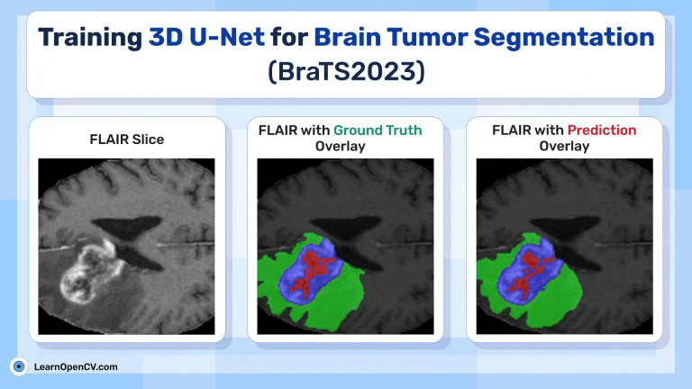

# Training 3D U-Net for Brain Tumor Segmentation (BraTS-GLI)

This folder contains the Jupyter Notebooks for the LearnOpenCV article  - **[Training 3D U-Net for Brain Tumor Segmentation (BraTS2023-GLI)](https://learnopencv.com/3d-u-net-brats/)**.

### We have provided:
* code to prepare dataset (`01_Data_Preprocessing.ipynb`)
* Model Training Script (`02_Training_3D_U-Net-83.59iou.ipynb`)
* Video inference code, at the last section of (`02_Training_3D_U-Net-83.59iou.ipynb`)

### Model Download:
- Download trained model from [here](https://www.dropbox.com/scl/fi/in1mx0t674d71bttw5b0p/3D_U-Net_BraTS_ckpt.tar?rlkey=eac3nha5rkyy1fpziifxv2kfq&st=aklryvmc&dl=1) and place it under `model_checkpoint/3D_UNet_Brats2023/version_0/ckpt.tar` . One can simply change the relative model path according to your notebook.

### Instructions:

- Run the `01_Data_Preprocessing.ipynb` to download and preprocess the [**BraTS2023-GLI** Subset from Kaggle](https://www.kaggle.com/datasets/aiocta/brats2023-part-1).
- After data preprocessing steps, switch to `02_Training_3D_U-Net-83.59iou.ipynb` for custom data loader preparation, model definition, training and inference scripts.

You can download the trained weights and code files as well from the below link.

## AI Courses by OpenCV

Want to become an expert in AI? [AI Courses by OpenCV](https://opencv.org/courses/) is a great place to start.

