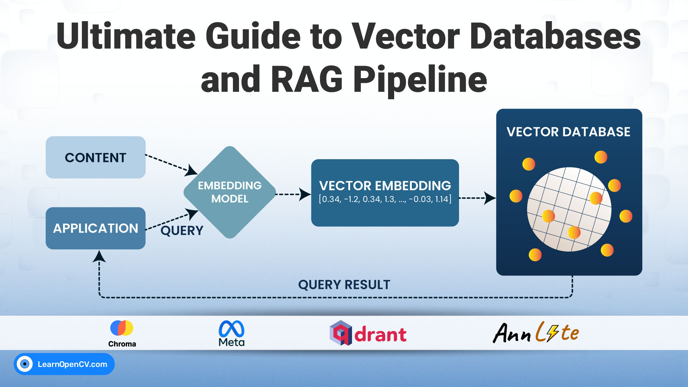

# Ultimate Guide to Vector Databases and RAG Pipeline

This blog post showcases a Multimodal RAG pipeline for complex document analysis. It utilizes PyMuPDF and Qdrant to index entire PDF pages (both text and visual context) and then feeds the retrieved page images directly into the Qwen-VL-3 model for highly grounded, citation-style summarization and visual question answering. 

It demonstrates Qdrant's role in linking vector similarity search with page-level metadata required for multimodal reasoning.   

It is part of the LearnOpenCV blog post - [Ultimate Guide to Vector Databases and RAG Pipeline](https://learnopencv.com/vector-db-and-rag-pipeline-for-document-rag/).

## AI Courses by OpenCV

Want to become an expert in AI? [AI Courses by OpenCV](https://opencv.org/courses/) is a great place to start.

