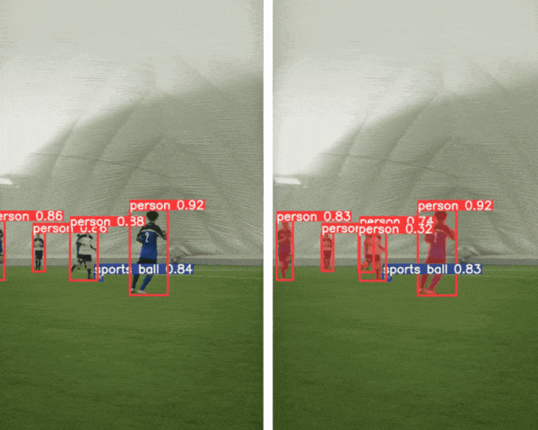

# README

This repository contains the inference notebook for running inference using the Ultralytics YOLOv8 models. This notebook is part of the [Ultralytics YOLOv8: State-of-the-Art YOLO Models](https://learnopencv.com/ultralytics-yolov8/) article.

The notebook runs inference for:

* Object detection
* Instance segmentation
* Image classification

## AI Courses by OpenCV

Want to become an expert in AI? [AI Courses by OpenCV](https://opencv.org/courses/) is a great place to start.

