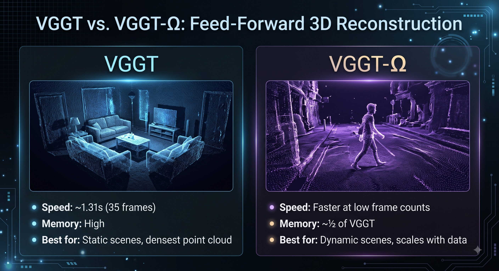

<p align="center">
  
</p>

Benchmark code for the LearnOpenCV post **[VGGT vs VGGT-Omega: 3D Reconstruction](https://learnopencv.com/vggt-vs-vggt-%cf%89-vggt-omega-a-complete-guide-to-feed-forward-3d-reconstruction/)**.

The notebook compares two 3D reconstruction models, **VGGT-1B** and **VGGT-Omega-1B-512**, each run two ways: standard **mixed precision** and true **bf16** (model weights cast to bfloat16, which roughly halves resident weight memory). It answers two questions:

- **Speed and memory:** how fast each model runs, how GPU memory grows with frame count, and the most frames that fit on a 32 GB GPU.
- **Accuracy:** how much the camera pose, depth map, and 3D point cloud change when you switch to bf16.

Each measurement runs in its own subprocess so the numbers stay clean and comparable, and the run is resumable if it gets interrupted.

## Maximum frames on a 32 GB GPU

Largest frame count that stays under 32 GB, measured on an RTX 5090:

| Model | Mixed precision | bf16 |
|---|---|---|
| VGGT-1B | 177 | 189 |
| VGGT-Omega-1B-512 | 280 | 331 |

## Setup

**1. Clone the model repos** as siblings of the notebook:
```bash
git clone https://github.com/facebookresearch/vggt
git clone https://github.com/facebookresearch/vggt-omega
```

**2. Install dependencies.** Install PyTorch matched to your GPU and CUDA from [pytorch.org](https://pytorch.org/get-started/locally/), then:
```bash
pip install opencv-python numpy pandas huggingface_hub safetensors einops trimesh matplotlib scipy
```
> Do not install the repos' `requirements.txt` blindly. They pin an old torch that can downgrade and break a newer, correctly matched install.

**3. Get the weights.**
- **VGGT-1B** is public and downloads automatically from Hugging Face on first run.
- **VGGT-Omega** is gated. Request access at [huggingface.co/facebook/VGGT-Omega](https://huggingface.co/facebook/VGGT-Omega), download `vggt_omega_1b_512.pt`, and place it next to the notebook.

**4. Add a video.** Point `VIDEO_PATH` in the Configuration cell at any video file you have.

Expected folder layout:
```
VGGT-vs-VGGT-Omega-3D-Reconstruction/
├── VGGT_vs_VGGT_Omega_Benchmark.ipynb
├── vggt/
├── vggt-omega/
├── vggt_omega_1b_512.pt
└── your_video.mp4
```
## Running

Open the notebook and run the cells in order. A full run (both models, both precisions, every frame count, plus the frame-ceiling search) takes roughly 1.5 to 2 hours. To check the setup first, set `QUICK_TEST = True` in the Configuration cell for a few-minute smoke test. Those numbers are only a sanity check, not the published results.

## Outputs

Everything lands under `benchmark_out/notebook_run/`:
- `results/` holds every measurement as JSON, plus a human-readable run log.
- `gltf/` holds four 3D reconstructions (VGGT and Omega, each in mixed and bf16) as `.gltf` and `.glb`, openable in any glTF viewer such as [gltf-viewer.donmccurdy.com](https://gltf-viewer.donmccurdy.com/).


---
<p align="center">
  <a href="https://bigvision.ai/">
    
  </a>
</p>

<h2 align="center">Build Production-Ready Computer Vision &amp; AI Solutions</h2>

<p align="center">
  LearnOpenCV is maintained by <a href="https://bigvision.ai/"><strong>BigVision.AI</strong></a>, a computer vision and AI consulting company. We help organizations design, build, optimize, and deploy production-ready AI solutions. Our team has deep expertise in computer vision, deep learning, multimodal AI, and edge deployment, with experience solving complex technical challenges across industries.
</p>

<p align="center">
  Have a project in mind? Talk with our expert AI solution builders.
</p>

<p align="center">
  <a href="https://bigvision.ai/expert-ai-solution-builders?utm_source=locv-github">
    
  </a>
</p>
