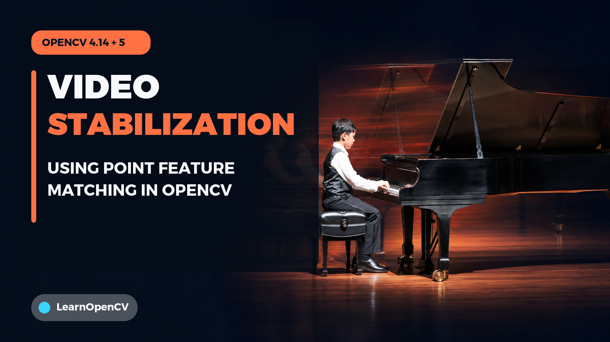

# Video Stabilization Using Point Feature Matching in OpenCV

[](https://learnopencv.com/video-stabilization-using-point-feature-matching-in-opencv/)

This folder contains the Python and C++ examples for the
[Video Stabilization Using Point Feature Matching in OpenCV](https://learnopencv.com/video-stabilization-using-point-feature-matching-in-opencv/)
tutorial. Both examples track point features between adjacent frames, estimate
partial-affine camera motion, smooth the resulting trajectory, and write the
original and stabilized views side by side.

[](https://github.com/spmallick/learnopencv/releases/download/video-stabilization-opencv-2026.07.24/VideoStabilization.zip)

The immutable, versioned bundle has a published
[SHA-256 checksum](https://github.com/spmallick/learnopencv/releases/download/video-stabilization-opencv-2026.07.24/VideoStabilization.zip.sha256).
It contains exactly one top-level `VideoStabilization/` directory and the nine
files shown in the standalone ZIP layout below. The repository also carries the
article preview image `video-stabilization-opencv-4-14-5.jpg`; that
documentation-only image was added after the tagged standalone release and is
not required to build, run, or test the downloaded project.

## Compatibility contract

- OpenCV 4.14.0
- OpenCV 5.0.0
- Python 3.9 or newer
- NumPy 1.23 or newer
- CMake 3.16 or newer
- A C++17 compiler

The compatibility matrix is tested against the exact OpenCV `4.14.0` and
`5.0.0` release tags. The Python and C++ examples use the APIs shared by both
versions.

The checked-in dependency ranges admit both supported OpenCV majors:

```text
numpy>=1.23,<3
opencv-python>=4.8,<6
```

The broad range lets `pip` select an available compatible OpenCV 4 or 5 wheel.
The acceptance matrix builds the OpenCV 4.14 Python binding and both C++
libraries from the exact `4.14.0` and `5.0.0` source tags; the OpenCV 5 Python
run uses the exact `5.0.0` wheel. The examples use
`estimateAffinePartial2D` and the modern two-value Python return contract, which
are shared by both releases. The removed OpenCV 3-only
`estimateRigidTransform` compatibility branch is no longer needed.

## Input and output

The bundled `video.mp4` is resolved relative to the source file, so the default
commands work from the project directory or from an unrelated current
directory. Use `--input PATH` to process another video.

Output defaults to `output/video_out.mp4`. The output directory is created
automatically. Use `--output-dir PATH` and `--output-name NAME` to change it.
The program rejects an output path, symlink, or hard link that resolves to the
input video, preventing accidental source truncation.
The video contains the original frame on the left and stabilized frame on the
right. When the side-by-side result is wider than 1920 pixels, both dimensions
are halved to keep the preview and output manageable.

Useful options shared by both implementations:

- `--input PATH`: choose an input video.
- `--output-dir PATH`: choose the output directory.
- `--output-name NAME`: choose the output filename.
- `--smoothing-radius N`: set the non-negative moving-average radius.
- `--no-display`: disable the preview window for headless use.
- `--validate`: check the output frame count, dimensions, and readability, then
  print `VALIDATION PASSED`.

Press Escape to stop an interactive preview early when `--validate` is not in
use. Validation requires processing the complete readable clip.

## Run the Python example

From `VideoStabilization`:

```shell
python3 -m venv .venv
source .venv/bin/activate
python -m pip install -r requirements.txt
python video_stabilization.py
```

For a repeatable headless run:

```shell
python video_stabilization.py \
  --no-display --validate
```

The script can also be launched from any directory:

```shell
python /absolute/path/to/VideoStabilization/video_stabilization.py \
  --output-dir /tmp/video-stabilization --no-display --validate
```

Run the Python regression tests from the repository root:

```shell
python -m unittest discover -s VideoStabilization/tests -v
```

The six tests exercise the real command-line entry point from unrelated
directories, validate the bundled and generated synthetic videos, count every
output frame, check smoothing and tracked-point behavior, verify concise input
and output errors, and prove that a path collision cannot overwrite the source.

## Build and run the C++ example

From `VideoStabilization`:

```shell
cmake -S . -B build -DCMAKE_BUILD_TYPE=Release
cmake --build build --parallel
./build/video_stabilization
```

To select a particular OpenCV installation:

```shell
cmake -S . -B build-opencv5 \
  -DCMAKE_BUILD_TYPE=Release \
  -DOpenCV_DIR=/path/to/opencv-5/lib/cmake/opencv5
cmake --build build-opencv5 --parallel
```

Run the C++ regression from any directory:

```shell
/absolute/path/to/build/video_stabilization \
  --output-dir /tmp/video-stabilization-cpp \
  --no-display --validate
```

Or run the registered CTests:

```shell
ctest --test-dir build --output-on-failure
```

CTest covers the complete bundled-video regression and a safe input/output
collision check that operates on a build-directory copy. The build requests
only the OpenCV modules used by the example, rejects
unsupported major versions, and compiles with warnings treated as errors.
OpenCV 5 moved `estimateAffinePartial2D` from `calib3d` to the new `geometry`
module and `goodFeaturesToTrack` from `imgproc` to the new `features` module.
The CMake configuration and version-gated includes select the correct modules
while the source keeps the same algorithm and public API calls in both releases.

## Project files in the repository

```text
VideoStabilization/
├── .gitignore
├── CMakeLists.txt
├── README.md
├── requirements.txt
├── tests/
│   ├── check_collision_guard.cmake
│   └── test_video_stabilization.py
├── video.mp4
├── video-stabilization-opencv-4-14-5.jpg
├── video_stabilization.cpp
└── video_stabilization.py
```

## Standalone ZIP layout

```text
VideoStabilization/
├── .gitignore
├── CMakeLists.txt
├── README.md
├── requirements.txt
├── tests/
│   ├── check_collision_guard.cmake
│   └── test_video_stabilization.py
├── video.mp4
├── video_stabilization.cpp
└── video_stabilization.py
```

---

<p align="center">
  <a href="https://bigvision.ai/">
    
  </a>
</p>

<h2 align="center">Build Production-Ready Computer Vision &amp; AI Solutions</h2>

<p align="center">
  LearnOpenCV is maintained by <a href="https://bigvision.ai/"><strong>BigVision.AI</strong></a>, a computer vision and AI consulting company. We help organizations design, build, optimize, and deploy production-ready AI solutions. Our team has deep expertise in computer vision, deep learning, multimodal AI, and edge deployment, with experience solving complex technical challenges across industries.
</p>

<p align="center">
  Have a project in mind? Talk with our expert AI solution builders.
</p>

<p align="center">
  <a href="https://bigvision.ai/expert-ai-solution-builders?utm_source=locv-github">
    
  </a>
</p>
