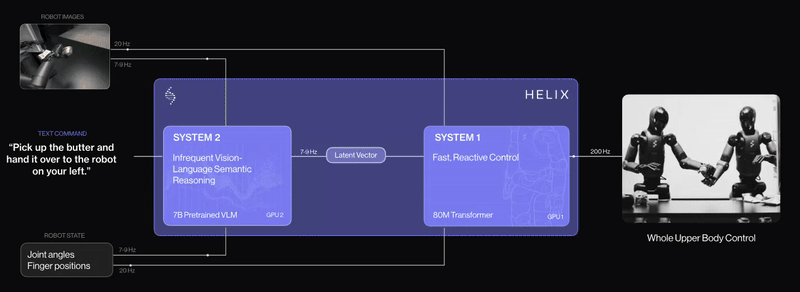

# Vision Language Action Models for Robot Control

**This repository contains inference code for [Vision Language Action Models](https://learnopencv.com/vision-language-action-models-lerobot-policy/) blogpost** 

1. Octo Transformer 
2. Pi-Zero
3. GR00T N1

## AI Courses by OpenCV

Want to become an expert in AI? [AI Courses by OpenCV](https://opencv.org/courses/) is a great place to start.

