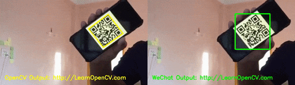

# WeChat QR Code Scanner in OpenCV

## Models
WeChat QR Code model files : https://github.com/WeChatCV/opencv_3rdparty/tree/wechat_qrcode


## Run Code

### C++
```
cmake .
make
./wechatQRcodeReader <input_file> (Leave blank for default image)
```

### Python
```
python wechatQRcodeReader.py <input_file> (Leave blank for default image)
```

## Sample Result
<p align="center">



# AI Courses by OpenCV

Want to become an expert in AI? [AI Courses by OpenCV](https://opencv.org/courses/) is a great place to start. 

<a href="https://opencv.org/courses/">
<p align="center"> 

</p>
</a>
