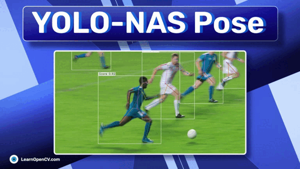

# YOLO-NAS Pose

This repository contains the notebook for the blog post - [YOLO-NAS Pose](https://learnopencv.com/yolo-nas-pose).

---

**You can run it on your local system or on Colab.**

---

## AI Courses by OpenCV

Want to become an expert in AI? [AI Courses by OpenCV](https://opencv.org/courses/) is a great place to start.

