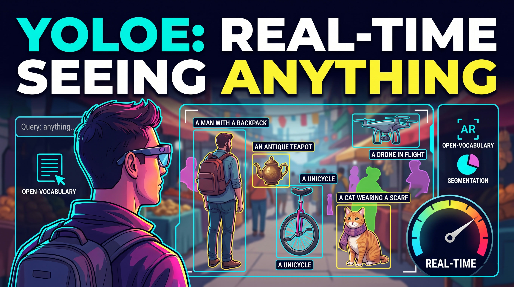

# How to Master YOLOE: Real-Time Open-Vocabulary Detection Made Easy

This notebook is the code companion to the LearnOpenCV blog post **[How to Master YOLOE: Real-Time Open-Vocabulary Detection Made Easy](https://learnopencv.com/yoloe-tutorial-real-time-open-vocabulary-detection/)**.

YOLOE is an open-vocabulary detection and instance segmentation model from Tsinghua University that brings text-prompted, visual-prompted, and prompt-free inference into the real-time YOLO efficiency regime. The notebook walks through every prompting mode end-to-end on images and videos, with the latest YOLOE-26 backbone as the primary model.

---

## What This Notebook Covers

1. **Environment setup** — single `pip install`, runs identically on Google Colab, Windows, macOS, and Linux
2. **Text-prompted inference** — simple, multi-class, color-attribute, compositional, and live prompt-input examples
3. **Visual-prompted inference** — interactive bounding-box drawing for reference selection, plus a portable hardcoded alternative
4. **Prompt-free inference** — open-world labeling using a built-in vocabulary of 4,585 classes
5. **Raw data access** — boxes, masks, class IDs, and confidences for downstream pipelines
6. **Text-prompted inference on video** — multiple scenes covering color attributes, size attributes, long-tail vocabulary, kitchen utensils, industrial scenes, and aerial small objects
7. **Object tracking** — persistent IDs across video frames using ByteTrack
8. **Backbone swap** — same prompts on YOLOE-26, YOLOE-11, and YOLOE-v8

---

## Quick Start

The recommended way to run this notebook is on Google Colab — click the badge above. The notebook installs all dependencies in the first cell and downloads test images and videos from a public Google Drive folder, so no setup is required on your machine.

If you prefer to run locally, open the notebook in Jupyter and run cells top to bottom. A CUDA-capable GPU is recommended for video inference but not required — the notebook auto-detects CUDA, Apple Silicon (MPS), and CPU.

---

## Models Used

| Variant | Use case |
|---|---|
| `yoloe-26l-seg.pt` | Primary model — text and visual prompts |
| `yoloe-26l-seg-pf.pt` | Prompt-free open-world labeling |
| `yoloe-11l-seg.pt`, `yoloe-v8l-seg.pt` | Alternative backbones |

All checkpoints are auto-downloaded by the Ultralytics package on first use.

---
