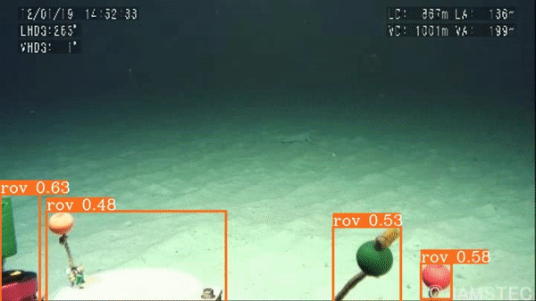

# YOLOv6 Custom Dataset Training – Underwater Trash Detection

This repository contains the code for the LearnOpenCV blog post **[YOLOv6 Custom Dataset Training - Underwater Trash Detection](https://learnopencv.com/yolov6-custom-dataset-training/)**

We train several YOLOv6 models on real-life and challenging dataset to detect underwater trash on deep ocean floors.

- The `notebooks` directory contains the Jupyter Notebook which will run end-to-end with one click. If you have Ubuntu, you can run it locally. Else, you may also upload it to Colab and run it. The notebook will train three different models for different experiments.
- The three training experiments are:
  - Fine tuning YOLOv6 Nano model.
  - Fine tuning YOLOv6 Small model.
  - Fine tuning YOLOv6 Large model.

***Download the trained weights [from here](https://www.dropbox.com/scl/fo/el30dlgk1xufe6lu9eu7b/h?dl=1&rlkey=qqnfl70pov5lywdm6stftx1xw).***

## AI Courses by OpenCV

Want to become an expert in AI? [AI Courses by OpenCV](https://opencv.org/courses/) is a great place to start.

