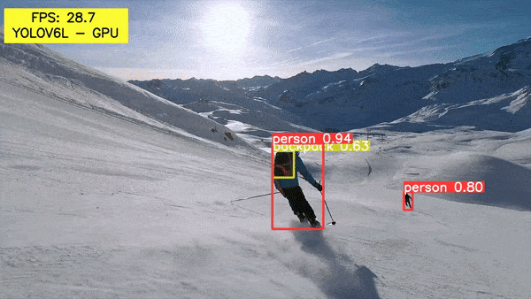

# YOLOv6 Object Detection – Paper Explanation and Inference

This repository contains the notebook for the blog post **[YOLOv6 Object Detection – Paper Explanation and Inference](https://learnopencv.com/yolov6-object-detection/)**

The `yolov6_inference.ipynb` notebook contains the code to run inference on images using the following YOLO6 models:

* YOLOv6 Nano
* YOLOv6 Medium
* YOLOv6 Large

**You can run it on your local system or on Colab. All the requirements will be installed automatically.**

[**Open Notebook on Google Colab**](https://colab.research.google.com/github/spmallick/learnopencv/blob/master/YOLOv6-Object-Detection-Paper-Explanation-and-Inference/yolov6_inference.ipynb)

## AI Courses by OpenCV

Want to become an expert in AI? [AI Courses by OpenCV](https://opencv.org/courses/) is a great place to start.

