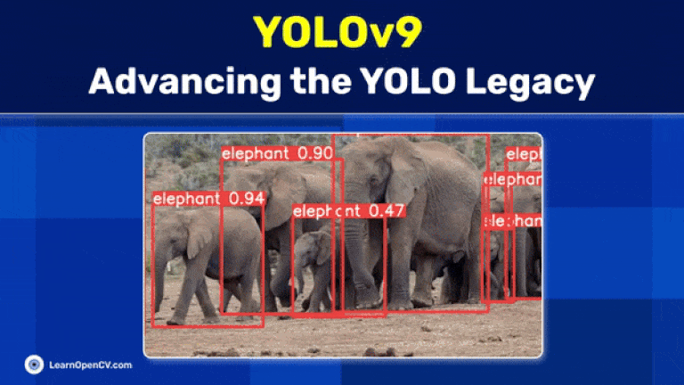

# YOLOv9: Advancing the YOLO Legacy

This repository contains the Python scripts to run the Inference.   

It is part of the LearnOpenCV blog post - [YOLOv9: Advancing the YOLO Legacy](https://learnopencv.com/yolov9-advancing-the-yolo-legacy/).

### Run Inference

Replace the ``general.py`` file in your python environment.

## AI Courses by OpenCV

Want to become an expert in AI? [AI Courses by OpenCV](https://opencv.org/courses/) is a great place to start.

