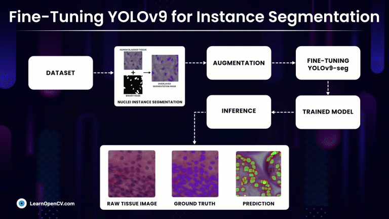

# YOLOv9 Instance Segmentation on Medical Dataset

**This repository contains code for [YOLOv9 Instance Segmentation on Medical Dataset](https://learnopencv.com/yolov9-instance-segmentation-on-medical-dataset/) blogpost**.

---

# AI Courses by OpenCV

Want to become an expert in AI? [AI Courses by OpenCV](https://opencv.org/courses/) is a great place to start. 

<a href="https://opencv.org/courses/">

 

</a>

