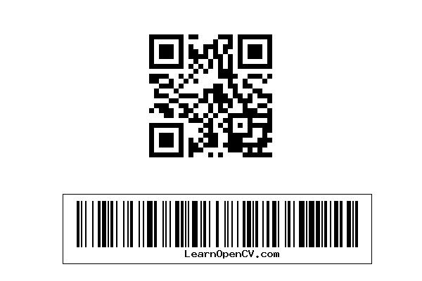

# [Barcode and QR Code Scanner Using OpenCV](https://learnopencv.com/barcode-and-qr-code-scanner-using-zbar-and-opencv/)

<p align="center">
  <a href="https://learnopencv.com/barcode-and-qr-code-scanner-using-zbar-and-opencv/">
    
  </a>
</p>

[](https://github.com/spmallick/learnopencv/releases/download/barcode-qr-opencv-2026.07.27/barcode-QRcodeScanner-2026.07.27.zip)

This refresh replaces the old Python 2 and mandatory ZBar paths with OpenCV's
native `QRCodeDetector` and `barcode::BarcodeDetector` APIs. Both programs scan
headlessly, print tab-separated results, and save an annotated image.

## Supported formats

| Detector | Formats covered by this example |
|---|---|
| `QRCodeDetector` | Standard QR codes, including multiple codes in one frame |
| `BarcodeDetector` | EAN-8, EAN-13, UPC-A, and UPC-E retail barcodes |

OpenCV's barcode detector is not a general replacement for every ZBar format.
If an application needs Code 128, Code 39, Data Matrix, Aztec, or PDF417, use a
decoder that explicitly supports those symbologies and test it with production
images. The lower one-dimensional code in the bundled historical fixture is not
an EAN/UPC code; the native example correctly reports only its QR code.

## Requirements

- Python 3.10 or newer
- NumPy 2.0 or newer
- OpenCV-Python 4.8 or newer
- Native OpenCV 4.8 or newer, including OpenCV 5.x
- CMake 3.16 and a C++17 compiler for the native example

The barcode detector moved from the contrib repository into OpenCV's main
`objdetect` module for OpenCV 4.8. Do not install `opencv-python` and
`opencv-contrib-python` together in the same environment.

The tested environments were Python 3.14.3 with OpenCV-Python 4.13.0, exact
native OpenCV 4.13.0 with AppleClang 21, and the official OpenCV 5.0.0 build in both
Python and C++.

## Python

```bash
python -m pip install -r requirements.txt
python barcode-QRcodeScanner.py zbar-test.jpg \
  --output output/decoded-codes.png
```

Use `--no-barcode` or `--no-qr` to isolate one detector. Add `--display` only
when a graphical desktop is available.

## C++

```bash
cmake -S . -B build -DCMAKE_BUILD_TYPE=Release
cmake --build build --parallel
./build/barcode_qr_scanner zbar-test.jpg \
  --output output/decoded-codes-cpp.png
```

To build against OpenCV 5 explicitly:

```bash
cmake -S . -B build \
  -DOpenCV_DIR=/path/to/opencv/lib/cmake/opencv5
```

## Tests

```bash
python -m unittest discover -s tests -v
ctest --test-dir build --output-on-failure
```

The Python suite verifies the bundled QR payload, generates a valid EAN-13 image
in memory and checks its decoded value and type, and checks annotation. CTest
runs the C++ QR path. The same three Python tests and one C++ smoke test passed
with OpenCV 4 and exact OpenCV 5.0.0; the C++ EAN-13 path was also exercised
against the generated fixture.

## Project layout

```text
barcode-QRcodeScanner/
├── CMakeLists.txt
├── README.md
├── barcode-QRcodeScanner.cpp
├── barcode-QRcodeScanner.py
├── requirements.txt
├── tests/
│   └── test_barcode_qr_scanner.py
└── zbar-test.jpg
```

---

<p align="center">
  <a href="https://bigvision.ai/">
    
  </a>
</p>

<h2 align="center">Build Production-Ready Computer Vision &amp; AI Solutions</h2>

<p align="center">
  LearnOpenCV is maintained by <a href="https://bigvision.ai/"><strong>BigVision.AI</strong></a>, a computer vision and AI consulting company. We help organizations design, build, optimize, and deploy production-ready AI solutions. Our team has deep expertise in computer vision, deep learning, multimodal AI, and edge deployment, with experience solving complex technical challenges across industries.
</p>

<p align="center">
  Have a project in mind? Talk with our expert AI solution builders.
</p>

<p align="center">
  <a href="https://bigvision.ai/expert-ai-solution-builders?utm_source=locv-github">
    
  </a>
</p>
