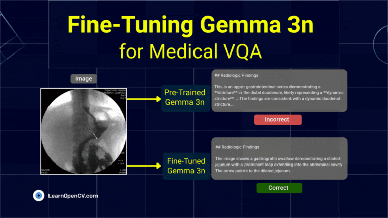

# FineTuning Gemma 3n for Medical VQA on ROCOv2

This repository contains the Python scripts to run the Inference.   

It is part of the LearnOpenCV blog post - [FineTuning Gemma 3n for Medical VQA on ROCOv2](https://learnopencv.com/finetuning-gemma-3n-medical-vqa/).

### Run Inference

Use the ``finetune_gemma3n_rocov2.ipynb`` notebook in **jupyter**, **colab** or similar environment to fine tune the model on your dataset.

**Note** - The Model and the Code requires a efficient consumer GPU like **Nvidia GeForce RTX 3070 Ti Laptop GPU** or **Nvidia Tesla T4** to run the inference. 

### PS: This Fine Tuning requires at least **`> 16 GB`** of **VRAM**.

## AI Courses by OpenCV

Want to become an expert in AI? [AI Courses by OpenCV](https://opencv.org/courses/) is a great place to start.

