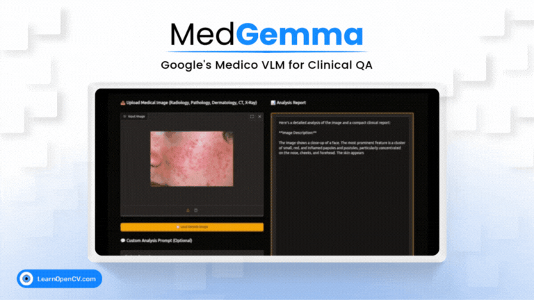

# MedGemma: Google’s Medico VLM for Clinical QA, Imaging, and More

This repository contains the Python scripts to run the Inference.   

It is part of the LearnOpenCV blog post - [MedGemma: Google’s Medico VLM for Clinical QA, Imaging, and More](https://learnopencv.com/medgemma-explained/).

### Run Inference

Install the dependencies with the ``requirements.txt`` file.

Use the ``app.py`` file to run the inference. Alternatively you can run the ``quick_start_with_hugging_face.ipynb`` notebook in **jupyter** or similar environment.

**Note** - The Model and the Code requires a efficient cosumer GPU like **Nvidia GeForce RTX 3070 Ti Laptop GPU** to run the inference.

## AI Courses by OpenCV

Want to become an expert in AI? [AI Courses by OpenCV](https://opencv.org/courses/) is a great place to start.

