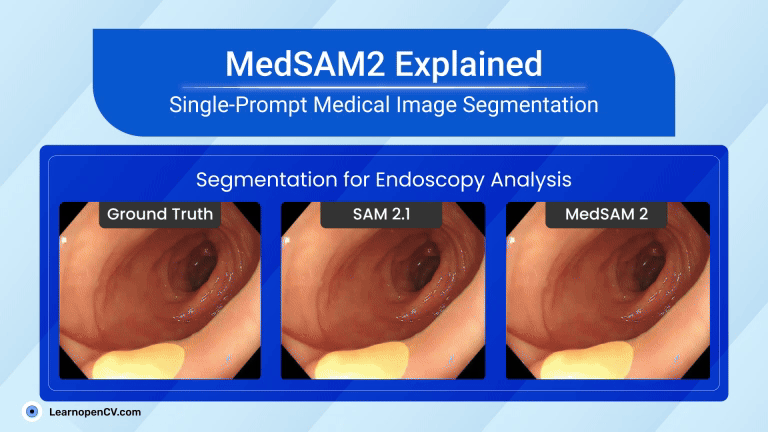

# MedSAM2 Explained: One Prompt to Segment Anything in Medical Imaging

This repository contains the Python scripts to run the Inference.   

It is part of the LearnOpenCV blog post - [MedSAM2 Explained: One Prompt to Segment Anything in Medical Imaging](https://learnopencv.com/medsam2-explained/).

## Run Inference

### 3D-CT Image Segmentation

Use the ``MedSAM2_inference_CT_Lesion.ipynb``  notebook to run the inference. Test data is given in the notebook.

### Endoscopy Video Segmentation

Use the ``MedSAM2_Inference_Video.ipynb``  notebook to run the inference. Test data is given in the notebook.

## AI Courses by OpenCV

Want to become an expert in AI? [AI Courses by OpenCV](https://opencv.org/courses/) is a great place to start.

